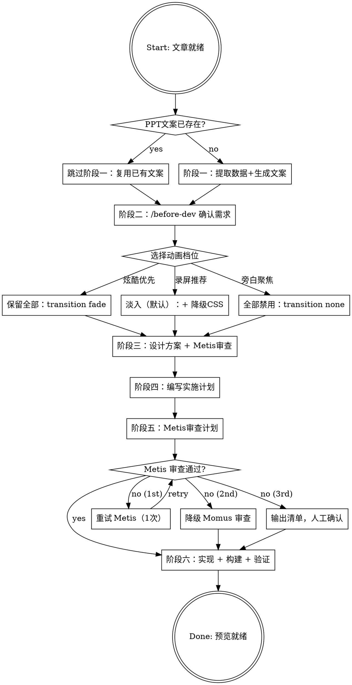

# Article to Presentation

将内容文章转化为 neocarbon 主题的 Slidev HTML 演示文稿，用于 B站视频录制。

**核心原则**：AI 代理生成 Markdown 幻灯片，neocarbon 主题接管视觉。六个阶段，每个阶段有明确产出和审查点——不可跳过。

## Quick Reference

| 操作 | 阶段 | 关键动作 |
|------|------|----------|
| 从文章开始 | 阶段一 | 提取数据 → 生成 PPT 文案 |
| 已有 PPT 文案 | 跳过阶段一 | 读取复用 `PPT文案.md` |
| 确认需求 | 阶段二 | `/before-dev` 确认观众/风格/动画 |
| 设计方案 | 阶段三 | 布局映射 + 组件选型 → Metis 审查 |
| 编写计划 | 阶段四 | **REQUIRED SUB-SKILL:** Use writing-plans |
| 审查计划 | 阶段五 | Metis 审查（降级：Momus → 人工） |
| 构建预览 | 阶段六 | 生成 `slides.md` → `slidev build` → `serve` 验证 |

## When to Use

- 用户要求将文章转为 PPT、演示文稿、幻灯片
- 用户需要 B站视频录制素材
- 触发关键词：幻灯片、演示文稿、PPT、B站视频素材、slidev、neocarbon

## When NOT to Use

- **线下演讲的实时演示** — 需要不同的节奏和交互设计
- **纯文字幻灯片** — 无图表/组件时，直接写 Markdown 即可，无需整套流程
- **非中文内容且无 CJK 字体需求** — neocarbon 主题针对 CJK 优化，纯英文场景用其他工具更轻量

## 决策流程图



---

## 阶段一：数据提取 + PPT文案生成

**输入**：文章（MD/TXT/URL）
**输出**：`content/ppt/YYYY-MM-DD-<topic>/PPT文案.md`

⚠️ **优先复用**：如果目标目录已存在 `PPT文案.md`，先读取复用——不要重新生成。仅当缺失或不完整时才从头提取。

提取 5 要素：
1. **核心论点** — 文章想传达什么
2. **关键数据** — 可量化的数字、百分比、趋势
3. **故事线** — 章节划分和叙事结构（通常 4-6 章）
4. **金句** — 适合独立展示的引用或警句
5. **数据来源** — 每个数据的出处（≥6 个来源交叉验证）

按章节组织 PPT 文案，每章标明幻灯片内容、图表类型。每个数据点标注来源，区分一手数据（原始报告）和二手数据（媒体报道）。

---

## 阶段二：需求确认

使用 `/before-dev` 命令逐步确认。

### 固定值（不询问，直接应用）

| 维度 | 值 |
|------|-----|
| 使用场景 | B站视频录屏 |
| 框架 | Slidev + `@enyineer/slidev-theme-neocarbon` |
| 文件 | `slides.md` → `slidev build` → `dist/` SPA；依赖在根 `package.json` 统一管理 |
| 图表 | neocarbon 25 组件 + Mermaid |
| 翻页 | 键盘纯手动 |
| CJK 字体 | `fonts.sans: 'PingFang SC, Microsoft YaHei, Noto Sans SC'` / `fonts.provider: none` |

### 需要确认

| 维度 | 选项 |
|------|------|
| 目标观众 | 技术人员 / 职场白领 / 泛科技爱好者 / 混合 |
| 故事风格 | 数据驱动 / 叙事型 / 观点输出 / 混合 |
| 幻灯片数量 | 15-20 / 25-35 / 40-50 |

### 动画策略

| 档位 | 配置 | 说明 |
|------|------|------|
| 保留全部 | `transition: fade`，无额外 CSS | 视觉最炫但录屏可能有动画噪音 |
| **淡入（默认，录屏推荐）** | `transition: fade` + 三段降级 CSS | 仅 fade，禁用 staggered/shimmer/particles |
| 全部禁用 | `transition: none` + 全禁 CSS | 纯静态，适合画外音旁白聚焦 |

完整 CSS 模板 → [references/technical-details.md](references/technical-details.md)「Click 动画配置」章节。

> neocarbon 不支持 `clickAnimation` frontmatter，动画仅靠 `<style>` CSS 控制。

### 布局映射（可选覆盖）

5 个最常用布局（速查）：

| PPT 内容类型 | 推荐方案 | 示例 |
|-------------|---------|------|
| 封面主标题 | `cover` 布局 | "AI压缩了执行力，放大了判断力" |
| 章节分隔 | `section` 布局 | "第一章 · 执行层的差距" |
| 开场钩子（引用） | `quote` 布局 | 开篇引语 |
| 柱状图对比 | `default` + `<NcBarChart />`（十六进制颜色） | 89% vs 88% |
| 左右概念对比 | `default` + 自定义 flex 容器 | 可编码 vs 默会 |
| 并排指标卡 | `default` + flex 容器 | 19% vs 5-7% |
| 多条目分组 | `default` + 双栏卡片布局 | 规则 + 结果对比 |

> ⚠️ **避免使用 `comparison` 和 `::metrics::`** — 改用 `default` + 自定义 flex 容器，更稳定可控。

完整 19 种映射 + 组件 API + 设计令牌 → [references/technical-details.md](references/technical-details.md)

确认后输出：`content/ppt/YYYY-MM-DD-<topic>/PPT设计.md`

---

## 阶段三：设计方案

输出内容：
0. **配色预设选择**：从预设库选基础配色（默认霓虹紫）。完整预设 → [references/technical-details.md](references/technical-details.md)「配色预设库」
1. **主题配置**：`--nc-accent`、`--nc-success`、`--nc-danger` 颜色值
2. **动画策略**：按阶段二确认的档位
3. **布局映射表**：确认或覆盖默认映射
4. **幻灯片结构**：按章节组织，每张幻灯片指定布局 + 组件

提交设计文档给 **Metis** 审查。

---

## 阶段四：实施计划

**REQUIRED SUB-SKILL:** Use writing-plans for implementation planning.

### 文件结构

```
content/ppt/YYYY-MM-DD-<topic>/
├── slides.md           ← AI 生成的 Slidev Markdown
└── dist/               ← slidev build 输出（gitignore）
```

> 依赖统一放在项目根 `package.json` + `node_modules/`，不在每个 PPT 目录单独初始化。

### 任务拆分

| # | 任务 | 执行 | 说明 |
|---|------|------|------|
| 1 | 创建 PPT 目录 + 确认根依赖就绪 | 主流程 | ⚠️ 目录名必须纯 ASCII |
| 2 | 编写 `slides.md` frontmatter + `<style>` CSS | 主流程 | 颜色语义 + 骨架结构 |
| 3 | 封面 + 章节标题（`cover`, `section`） | 主流程 | 模板化输出 |
| 4 | 数据图表（`default` + 组件，十六进制颜色） | 主流程 | 布局映射 + 颜色编码 |
| 5 | 引用/金句/案例/结尾 + 数据来源 | 主流程 | 需理解文章语境 |
| 6 | `slidev build` + 预览 + 手动验证 | 主流程 bash | CLI 命令，不派发子代理 |

### 环境要求

- Node.js ≥ 20.12.0
- `@slidev/cli` 精确版本 `52.0.0`
- `@enyineer/slidev-theme-neocarbon` 精确版本 `1.0.8`

### npm 策略

```bash
# 根目录 package.json 包含依赖
# 首次使用：在项目根执行一次
npm install --registry https://registry.npmmirror.com

# 后续使用：确认 node_modules 已有依赖即可
ls node_modules/@slidev/cli node_modules/@enyineer/slidev-theme-neocarbon
```

> ⚠️ WSL 下 `rm -rf node_modules` 可能因深层嵌套报 `ENOTEMPTY`。用 `find . -name node_modules -exec rm -rf {} + 2>/dev/null`。

---

## 阶段五：计划审查

提交给 **Metis** 审查。重点：数据准确性、布局映射合理性、neocarbon 组件使用、颜色编码合规。

常见审查发现 → [references/common-pitfalls.md](references/common-pitfalls.md)

### Metis 审查失败降级

| 次序 | 策略 | 说明 |
|------|------|------|
| 1st | 重试 Metis（1 次） | 临时故障通常可恢复 |
| 2nd | 转 **Momus** 审查 | 不同审查视角，侧重计划完整性和可执行性 |
| 3rd | 输出审查清单，用户人工确认 | 跳过自动审查，将审查重点输出到对话中供逐项确认 |

> 审查失败 ≠ 计划有问题。基础架构错误不应阻塞流程。

---

## 阶段六：实现

### 项目初始化（Task 1）

1. 创建 PPT 目录（⚠️ **目录名必须纯 ASCII**，中文会导致 `slidev build` 失败）
2. 确认根 `node_modules/` 已安装依赖；缺失则在根执行 `npm install --registry https://registry.npmmirror.com`

### 写入 slides.md

关键要求：
- **必须**在 `slides.md` 末尾包含 `<style>` 块
- 完整 CSS 模板 → [references/technical-details.md](references/technical-details.md)

速查清单：
- 5 个 `--nc-*` CSS 变量（默认霓虹紫，详见「配色预设库」）
- CJK 行高：`.slidev-layout { line-height: 1.75; font-size: 24px; }`
- Mermaid 中文补丁：`svg text { font-family: 'PingFang SC',... }`
- 禁用 TOC：`export.withToc: false` + CSS 隐藏规则（见「录屏面板隐藏」）
- 内容垂直居中 CSS（见下方「视觉质量要求」）
- 动画降级 CSS 按档位选择（见「Click 动画配置」）

### 视觉质量要求 ⚠️ MANDATORY

以下 5 个问题是最常见的构建后视觉缺陷。**每张幻灯片都必须通过这 5 项检查**。

| # | 问题 | 根因 | 修复 |
|---|------|------|------|
| 1 | **内容偏上** — 内容集中在上半部分，下半屏大面积空白 | `default` 布局不自动居中 | 应用居中 CSS（见下方模板） |
| 2 | **卡片/标签太靠上** — 数据卡片距离顶部边缘过近 | 卡片容器无顶部外边距 | 卡片容器加 `margin-top: 1.5rem` |
| 3 | **缺少视觉焦点** — 幻灯片有内容但无标题，观众不知道这页要说什么 | AI 生成内容时遗漏标题 | **每张幻灯片必须有 `#` 或 `##` 标题**作为第一个内容元素 |
| 4 | **卡片间距过大** — 左右卡片 gap 太宽，横向空间利用低 | `gap: 2rem` 在 1920px 屏幕上过宽 | 双栏用 `gap: 1.5rem`；三栏用 `gap: 1.2rem` |
| 5 | **终端太空旷** — `<NcTerminal />` 行数不足，视觉空洞 | 终端内容少于 4 行 | 最少 6 行；内容短时填充上下文注释行 |

#### 修复 #1：内容垂直居中 CSS

```css
/* 强制 default 布局内容垂直居中 */
.slidev-layout.default {
  display: flex !important;
  flex-direction: column !important;
  justify-content: center !important;
  padding: 3rem 4rem !important;
}
/* 消除首元素的顶部外边距叠加 */
.slidev-layout.default > *:first-child {
  margin-top: 0 !important;
}
```

#### 修复 #2：卡片顶部边距

```css
/* 确保 flex 容器有顶部呼吸空间 */
.slidev-layout.default [style*="display:flex"],
.slidev-layout.default [style*="display: flex"] {
  margin-top: 1.5rem;
}
```

在 HTML 中，卡片容器显式添加 `margin-top`：
```html
<div style="display:flex; gap:1.5rem; margin-top:1.5rem;">
```

#### 修复 #3：每张幻灯片必须有标题

**强制规则**：除 `cover`、`section`、`quote`、`statement`、`spotlight` 布局外，所有 `default` 布局的幻灯片必须以 `# 标题` 或 `## 标题` 开头。

```markdown
# ❌ 错误 — 无标题
---
layout: default
---
<NcBarChart ... />

# ✅ 正确 — 有标题
---
layout: default
---
# AI 辅助编码成功率对比

<NcBarChart ... />
```

#### 修复 #4：卡片间距

```html
<!-- 双栏：gap 1.5rem（非 2rem） -->
<div style="display:flex; gap:1.5rem;">

<!-- 三栏：gap 1.2rem -->
<div style="display:flex; gap:1.2rem;">
```

#### 修复 #5：终端最少 6 行

```html
<!-- ❌ 错误 — 内容太少 -->
<NcTerminal :lines="['$ npm install', '✓ done']" />

<!-- ✅ 正确 — 最少 6 行，短内容用注释填充 -->
<NcTerminal
  title="部署流程"
  :lines="[
    '# Step 1: Install dependencies',
    '$ npm install --registry https://registry.npmmirror.com',
    '✓ 142 packages installed',
    '# Step 2: Build slides',
    '$ npx slidev build',
    '✓ Build complete → dist/',
  ]"
/>
```

### 构建与预览（Task 6）

主流程 `bash` 直接执行（不派发子代理——构建依赖环境状态）：

```bash
# 方式一：在项目根指定 slides.md 路径
npx slidev build content/ppt/YYYY-MM-DD-<topic>/slides.md

# 方式二：先 cd 到 PPT 目录（npx 会向上查找 node_modules）
cd content/ppt/YYYY-MM-DD-<topic> && npx slidev build

# 预览（⚠️ 不能直接用 file:// 打开 — CORS 阻止 JS 加载）
npx serve content/ppt/YYYY-MM-DD-<topic>/dist -p 3030 --no-clipboard
# 打开 http://localhost:3030
```

### 手动验证

- 浏览器调至 1920×1080，全屏（F11）
- 键盘左右方向键翻页，检查 **所有** 幻灯片
- **逐张检查 5 项视觉质量要求**（见上方）
- 颜色编码检查：
  - [ ] 默会知识/价值判断：`nc-text-success`（绿色），**不是** `nc-text-accent`
  - [ ] 下降/负面数据：`nc-text-danger`（红色）
  - [ ] 中性数据（如 93% 使用率）：`nc-text-accent`（紫色），**不是** 红色
  - [ ] 图表颜色使用十六进制值（**不是** CSS 变量）
- [ ] 所有数据点对照 PPT 文案逐条核对
- [ ] 数据来源数量一致（文案/计划/实现三方统一，≥6 个）
- [ ] 无 `::metrics::` slot（改用 flex 容器）
- [ ] 无 `comparison` 布局（改用自定义 flex）
- [ ] **每张幻灯片有标题**（修复 #3）

---

## 参考文件索引

| 文件 | 内容 | 何时读取 |
|------|------|----------|
| [references/technical-details.md](references/technical-details.md) | neocarbon 布局/组件 API、设计令牌、映射表、Slidev 配置模板、CSS 模板、配色预设库 | 阶段三/四/六 |
| [references/common-pitfalls.md](references/common-pitfalls.md) | 常见陷阱、审查发现、实现前检查清单 | 阶段五审查时 |
