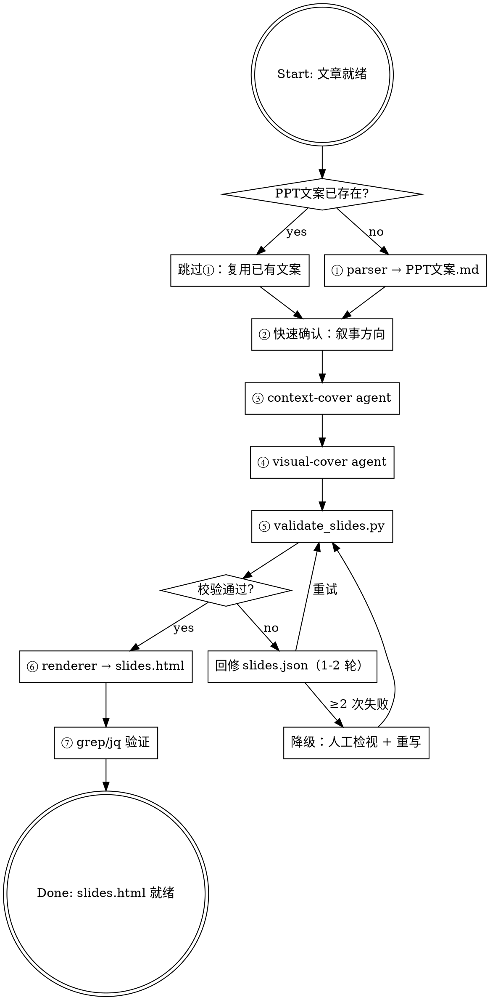

# Article to Presentation

将 Markdown 文章转化为深色科技风 HTML 演示文稿（单文件 `slides.html`），用于 B站视频录屏、公众号视频、知识分享。

**核心原则**：两个专用 Agent（`context-cover` 内容拆页 + `visual-cover` 视觉填充）串行生成 Slide DSL，Python HTML 模板引擎渲染为单文件网页，schema 自动校验替代人工审查。

## Quick Reference

| 步骤 | 动作 | 产出 |
|------|------|------|
| ① | 读文章 → `generate.py` | `PPT文案.md` |
| ② | 快速确认：叙事方向 | 无产出（口头确认） |
| ③ | `context-cover` agent | `slides.json`（type + visual + title） |
| ④ | `visual-cover` agent | `slides.json`（补 data + 颜色） |
| ⑤ | `validate_slides.py` 自动校验 | 通过/失败 → 回修 |
| ⑥ | `renderer` → 渲染 | `slides.html` |
| ⑦ | `grep`/`jq` 结构验证 | 结构检查通过 |

总耗时目标：< 5 分钟。

## When to Use

- 用户要求将文章转为 PPT、演示文稿、幻灯片
- 用户需要 B站视频录制素材
- 触发关键词：幻灯片、演示文稿、PPT、B站视频素材、科技风、HTML 演示

## When NOT to Use

- **线下演讲的实时演示** — 需要不同的节奏和交互设计
- **纯文字幻灯片** — 无图表/组件时，直接写 Markdown 即可
- **需要 PPTX/Keynote 编辑** — 本技能输出单文件 HTML，不可编辑

## 流程图



---

## ① 阶段一：数据提取

**输入**：文章 MD 文件
**输出**：`content/ppt/YYYY-MM-DD-<topic>/PPT文案.md`

⚠️ **优先复用**：如果目标目录已存在 `PPT文案.md`，先读取复用——不要重新生成。

```bash
mkdir -p content/ppt/YYYY-MM-DD-<topic>/

python .opencode/skills/article-to-presentation/scripts/generate.py \
  --input content/article/YYYY-MM-DD-<topic>.md \
  --output content/ppt/YYYY-MM-DD-<topic>/
```

提取 5 要素：核心论点、关键数据、故事线、金句、数据来源。每个数据点标注来源，区分一手/二手。

---

## ② 阶段二：快速确认

**只问一个关键问题**：叙事方向。

根据文章内容提供 2-3 个可选角度（人物驱动 / 战略分析 / 数据对比），用户 10 秒内可回答。

以下维度**使用默认值，不询问**：

| 维度 | 默认值 |
|------|--------|
| 目标观众 | 混合（技术人员 + 泛科技爱好者） |
| 幻灯片数量 | 12-18 张 |
| 动画策略 | 淡入（`fade-up` 入场，录屏稳定） |
| 使用场景 | B站视频录屏 / 公众号视频 |
| 比例 | 16:9，基准 1920×1080 |

---

## ③④ 阶段三/四：Agent 生成

### context-cover agent

**串行**调用，先内容拆页、再视觉填充。

```
PPT文案.md → context-cover agent → slides.json (type + visual + title)
```

`context-cover` agent（定义见 `.opencode/agents/context-cover.md`）：
- 输入：PPT文案.md
- 输出：`slides.json`，含 `type`、`visual`、`title`、`subtitle`、`eyebrow`、`data: {}`
- 每页一个观点，8-15 页

### visual-cover agent

```
slides.json (骨架) → visual-cover agent → slides.json (完整)
```

`visual-cover` agent（定义见 `.opencode/agents/visual-cover.md`）：
- 输入：前一步的 `slides.json`
- 输出：补全每页 `data`、`badge`、颜色、动画
- 必须遵守颜色语义：green=正面/增长，red=负面/下降，orange=中性强调

---

## ⑤ 阶段五：Schema 自动校验

渲染前跑校验脚本，替代 Metis 审查。

```bash
python .opencode/skills/article-to-presentation/renderer/validate_slides.py \
  content/ppt/YYYY-MM-DD-<topic>/slides.json
```

校验规则：
- 每页 `type`、`visual` 为合法值
- `type + visual` 组合有对应模板文件
- `data` schema 匹配模板预期（必填字段、Jinja2 冲突 key 检测）
- 颜色语义合规（red 不用于中性数据，green 不用于负面）

校验失败 → 提示具体错误 → 回修 slides.json → 重试 1-2 轮 → 还失败则人工介入。

---

## ⑥⑦ 阶段六/七：渲染 + 验证

```bash
# 渲染
python .opencode/skills/article-to-presentation/renderer/html_renderer.py \
  --slides content/ppt/YYYY-MM-DD-<topic>/slides.json \
  --output content/ppt/YYYY-MM-DD-<topic>/slides.html

# 结构验证（无浏览器）
# 检查幻灯片数量
jq '.slides | length' content/ppt/YYYY-MM-DD-<topic>/slides.json

# 检查每页标题覆盖率
grep -o '<h1 class="slide-title\|<h1 class="cover-title"' content/ppt/YYYY-MM-DD-<topic>/slides.html | wc -l

# 检查 CSS 结构
grep -o 'justify-content: center' content/ppt/YYYY-MM-DD-<topic>/slides.html | head -1
```

### 手动验证（可选）

浏览器打开 `slides.html`，1920×1080 全屏（F11），键盘 ←/→ 翻页检查。

### 输出目录结构

```text
content/ppt/YYYY-MM-DD-<topic>/
├── PPT文案.md          # 阶段一：AI 提取的文案
├── slides.json         # 阶段三/四：Slide DSL
└── slides.html         # 阶段六：最终单文件演示文稿
```

---

## 参考文件索引

| 文件 | 内容 | 何时读取 |
|------|------|----------|
| `.opencode/agents/context-cover.md` | context-cover agent 定义 | 阶段三 |
| `.opencode/agents/visual-cover.md` | visual-cover agent 定义 | 阶段四 |
| [parser/markdown_parser.py](parser/markdown_parser.py) | Markdown 解析器 | 阶段一 |
| [renderer/html_renderer.py](renderer/html_renderer.py) | HTML 渲染器 | 阶段六 |
| [renderer/validate_slides.py](renderer/validate_slides.py) | Schema 自动校验 | 阶段五 |
| [templates/](templates/) | Jinja2 模板集合（29 个） | 阶段六 |
| [scripts/generate.py](scripts/generate.py) | 一键生成入口 | 阶段一 |
