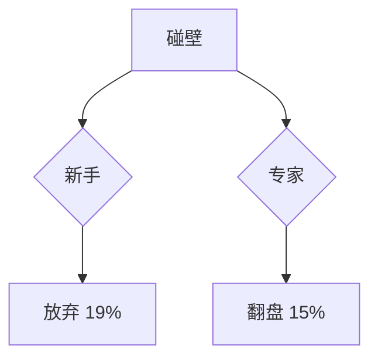
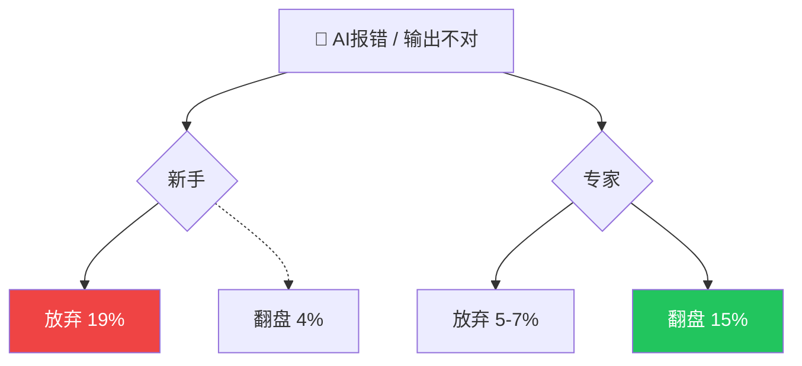

# 技术细节

## 配色方案

### neocarbon 设计令牌（必须覆盖）

在 `slides.md` 的 `<style>` 块中设置：

```html
<style>
:root {
  --nc-accent:  #ff6b35;   /* 橙色 → 中性强调、主标题高亮 */
  --nc-success: #22c55e;   /* 绿色 → 正面/上升/默会知识 */
  --nc-danger:  #ef4444;   /* 红色 → 负面/下降/警示 */
  --nc-warning: #f59e0b;   /* 琥珀 → 保留 */
  --nc-info:    #3b82f6;   /* 蓝色 → 保留 */
}
</style>
```

### CSS 实用类（内联颜色标注）

| 类 | 颜色 | 用途 |
|----|------|------|
| `nc-text-success` | 绿色 | 正面数据、默会知识、价值判断 |
| `nc-text-danger` | 红色 | 负面数据、下降趋势 |
| `nc-text-accent` | 橙色 | 中性强调、关键数据 |
| `nc-text-muted` | 灰色 | 辅助说明、脚注 |
| `nc-text-dim` | 深灰 | 次要文字 |

### 颜色编码规则

| 数据类型 | 颜色 | 实现 |
|----------|------|------|
| 增长/正面/默会知识 | 绿色 | `nc-text-success` 或 `var(--nc-success)` |
| 下降/负面 | 红色 | `nc-text-danger` 或 `var(--nc-danger)` |
| 中性/强调 | 橙色 | `nc-text-accent` 或 `var(--nc-accent)` |

**严格禁止**：红色用于中性数据（如 93% 使用率）；默会知识/价值判断用橙色代替绿色。

---

## 字体

neocarbon 捆绑 Monaspace Neon（英文等宽）。CJK 回退到系统字体栈，无需额外配置。

在 `slides.md` frontmatter 中可覆盖：

```yaml
fonts:
  sans: 'PingFang SC, Microsoft YaHei, sans-serif'
  serif: 'Noto Serif SC, serif'
  mono: 'Monaspace Neon, Fira Code, monospace'
```

---

## 幻灯片比例与录屏配置

- 目标：1920 × 1080（16:9）
- Slidev 默认使用浏览器窗口大小
- `slidev build` 产出 `dist/` SPA（**不能**通过 `file://` 直接打开）
- 录屏时使用 `npx serve dist -p 3030` → `http://localhost:3030`
- 浏览器手动调至 1920×1080，隐藏地址栏/书签栏

---

## Slidev 配置模板

### frontmatter（`slides.md` 顶部）

```yaml
---
theme: '@enyineer/slidev-theme-neocarbon'
title: '演示文稿标题'
info: |
  ## 副标题信息
  数据来源概述
highlighter: shiki
transition: fade
---
```

关键字段：
- `theme`：必须为 `'@enyineer/slidev-theme-neocarbon'`
- `transition: fade`：幻灯片过渡动画（可选 `none` 禁用）
- `highlighter: shiki`：代码高亮引擎（内置，无需额外依赖）

### `package.json`

```json
{
  "name": "ppt-project",
  "private": true,
  "scripts": {
    "build": "slidev build",
    "dev": "slidev --open",
    "export": "slidev export"
  },
  "dependencies": {
    "@slidev/cli": "52.0.0",
    "@enyineer/slidev-theme-neocarbon": "1.0.5"
  }
}
```

**注意**：版本为精确版本（无 `^`），避免 caret 范围引入 breaking changes。

### 环境要求

| 依赖 | 版本 |
|------|------|
| Node.js | >= 20.12.0 |
| npm | >= 9 |

---

## neocarbon 布局 API

### `cover` — 封面

```markdown
---
layout: cover
---
# 主标题

副标题或数据来源
```

### `section` — 章节分隔

```markdown
---
layout: section
---
# 章节名称
```

全屏分隔页，居中标题 + accent 下划线。

### `quote` — 引用

```markdown
---
layout: quote
---
> 引用文本内容

— 来源标注
```

超大引号标记 + 径向辉光。来源用 `—` 开头。

### `comparison` — 左右对比

```markdown
---
layout: comparison
---
::left::
左侧内容（暗面背景）

::right::
右侧内容（成功色调渐变）
```

使用 `::left::` / `::right::` 插槽分隔。

### `statement` — 金句/陈述

```markdown
---
layout: statement
---
# 核心陈述或金句

<span class="nc-text-muted">副标题或脚注</span>
```

全屏戏剧性陈述，支持换行高亮。多行金句（如"你可以让AI写一千个方案..."）使用此布局。

### `metrics` — 并排指标卡

```markdown
---
layout: metrics
---
::metrics::
<div class="nc-metric">
  <span class="nc-metric-value nc-text-danger">19%</span>
  <span class="nc-metric-label">新手放弃率</span>
</div>
<div class="nc-metric">
  <span class="nc-metric-value nc-text-accent">5-7%</span>
  <span class="nc-metric-label">专家放弃率</span>
</div>
```

每张卡使用 `.nc-metric` 包裹，`.nc-metric-value` 显示大数字，`.nc-metric-label` 显示标签。

### `diagram` — 图表分屏

```markdown
---
layout: diagram
---
::left::
图表说明文字

- 数据趋势解读
- 关键发现

::right::

```

**注意**：`diagram` 是分屏布局——左侧放文字说明，右侧放 Mermaid 图表。**不是**全屏图表。

### `default` — 正文（自由布局）

用于嵌入 neocarbon 组件或自定义内容：

```markdown
---
layout: default
---
# 幻灯片标题

<NcBarChart
  title="AI辅助编码 · 部分成功率"
  :labels="['软件工程师', '其他职业']"
  :data="[89, 88]"
  :colors="['var(--nc-success)', 'var(--nc-accent)']"
/>

<span class="nc-text-muted">数据来源：Anthropic 2026.6</span>
```

---

## neocarbon 组件 API

组件以 Vue 标签在 Markdown 中调用。**关键**：必须使用 `:` 前缀绑定非字符串 props（`:labels`, `:data`, `:colors` 等数组/数字）。

### `<NcBarChart />` — 柱状图

```html
<NcBarChart
  title="AI辅助编码 · 部分成功率"
  :labels="['软件工程师', '其他职业']"
  :data="[89, 88]"
  :colors="['var(--nc-success)', 'var(--nc-accent)']"
  height="280"
/>
```

| Prop | 类型 | 必填 | 说明 |
|------|------|------|------|
| `title` | string | 否 | 图表标题 |
| `labels` | string[] | 是 | X 轴标签 |
| `data` | number[] | 是 | 数据值（百分比 0-100 或绝对数值） |
| `colors` | string[] | 否 | 柱颜色（CSS 颜色值），默认使用主题色 |
| `height` | number | 否 | 图表高度（px），默认 240 |
| `horizontal` | boolean | 否 | 水平柱状图 |

### `<NcProgress />` — 进度条

```html
<NcProgress value="15" label="新手严格成功率" color="var(--nc-danger)" />
<NcProgress value="33" label="高级严格成功率" color="var(--nc-accent)" />
```

| Prop | 类型 | 必填 | 说明 |
|------|------|------|------|
| `value` | number | 是 | 百分比值（0-100） |
| `label` | string | 否 | 进度条标签 |
| `color` | string | 否 | 进度条颜色（CSS 颜色值） |

### `<NcLineChart />` — 折线图

用于趋势数据（如 7 个月变化）：

```html
<NcLineChart
  title="会话类型变化（7个月）"
  :labels="['Oct', 'Nov', 'Dec', 'Jan', 'Feb', 'Mar', 'Apr']"
  :datasets="[
    { label: '修复代码', data: [33, 30, 27, 25, 22, 20, 19], color: 'var(--nc-danger)' },
    { label: '写新代码', data: [10, 12, 14, 16, 18, 19, 20], color: 'var(--nc-success)' },
    { label: '数据分析', data: [10, 11, 13, 15, 17, 19, 20], color: 'var(--nc-accent)' },
  ]"
/>
```

| Prop | 类型 | 说明 |
|------|------|------|
| `title` | string | 图表标题 |
| `labels` | string[] | X 轴标签 |
| `datasets` | object[] | 数据集数组，每项包含 `label`, `data`, `color` |

---

## 自定义 CSS 辅助（无原生映射的内容类型）

以下类型 neocarbon 无 1:1 原生支持，需在 `slides.md` 的 `<style>` 块中添加少量 CSS：

### 阶梯图（3 根依次增高柱）

```html
<NcBarChart
  title="严格验证成功率"
  :labels="['新手', '中级', '高级']"
  :data="[15, 28, 33]"
  :colors="['var(--nc-danger)', 'var(--nc-accent)', 'var(--nc-accent)']"
/>
```

### Before/After 柱对比

```html
<NcBarChart
  title="修复代码占比变化"
  :labels="['修复代码']"
  :data="[19]"
  :colors="['var(--nc-danger)']"
/>
<div class="nc-text-muted" style="text-align:center; margin-top: 8px;">
  33% → <span class="nc-text-danger">19%</span>（7个月）
</div>
```

用单个柱 + 文字标注 before/after 值。

### Mermaid 流程图（分叉路径）



放在 `diagram` 布局的 `::right::` 插槽中。

---

## 动画控制

neocarbon 默认启用电影级动画。在 `slides.md` 的 `<style>` 块中控制：

### 降级为淡入（禁用 staggered/shimmer/particles）

```css
.nc-stagger > * { animation: none !important; opacity: 1 !important; }
.nc-shimmer { animation: none !important; }
.nc-particles { display: none !important; }
```

### 全部禁用

```css
.nc-stagger > *,
.nc-shimmer,
.nc-particles,
[class*="nc-animate"] { animation: none !important; opacity: 1 !important; }
```

并在 frontmatter 设置 `transition: none`。

---

## 布局映射表（完整版）

| PPT 内容类型 | neocarbon 方案 | 示例幻灯片 |
|-------------|---------------|-----------|
| 封面主标题 | `cover` 布局 | "AI压缩了执行力，放大了判断力" |
| 副标题/数据来源 | `statement` 布局 | 副标题 + 6 个来源脚注 |
| 章节分隔 | `section` 布局 | "第一章 · 执行层的差距正在消失" |
| 开场钩子（引用） | `quote` 布局 | "同一个AI，对不同的人'努力程度'不一样" |
| 柱状图对比 | `default` + `<NcBarChart />` | 89% vs 88%, 93% vs 58% |
| 并排指标卡 | `metrics` 布局 | 放弃率、动作数、输出词数 |
| 左右概念对比 | `comparison` 布局 | 可编码 vs 默会, EN vs CN 指令 |
| 金句（多行大字） | `statement` 布局 | "你可以让AI写一千个方案..." |
| 本质洞察 + 案例 | `quote` + 内嵌 case 卡片 | 焦虑洞察 + 策略总监案例 |
| 趋势数据 | `default` + `<NcLineChart />` | 7 个月会话类型变化 |
| 流程分叉图 | `diagram` + Mermaid | 碰壁→放弃/翻盘 |
| 数据来源列表 | `default` 布局 | 6 个来源 + 链接 |
| 结尾 | `statement` 布局 | "判断力 = 你的护城河" |
