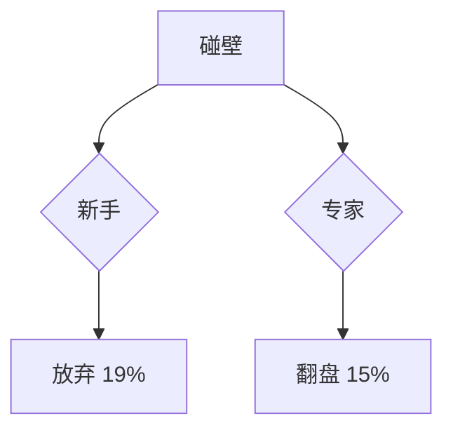
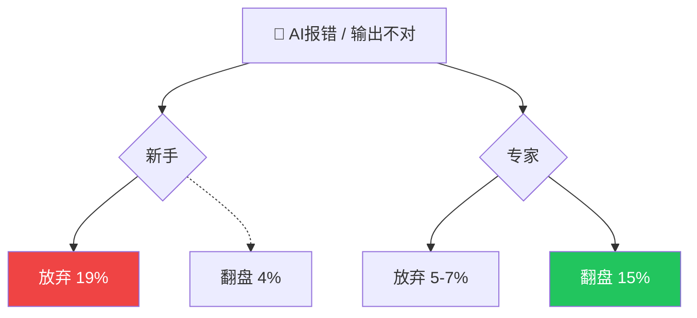

# 技术细节

## 配色预设库

### 预设 A：霓虹紫（默认）

适用场景：前沿科技、AI Agent、赛博朋克话题。

在 `slides.md` 的 `<style>` 块中设置：

```html
<style>
:root {
  --nc-accent:  #a855f7;   /* 紫 → 中性强调、主标题高亮 */
  --nc-success: #22d3ee;   /* 青 → 正面数据、上升/默会知识 */
  --nc-danger:  #f43f5e;   /* 玫红 → 负面数据、下降/警示 */
  --nc-warning: #fbbf24;   /* 琥珀 → 保留 */
  --nc-info:    #818cf8;   /* 靛蓝 → 保留 */
}
</style>
```

### 预设 B：暖橙

适用场景：数据分析、趋势报告、综合科技内容。

```html
<style>
:root {
  --nc-accent:  #ff6b35;   /* 橙色 → 中性强调 */
  --nc-success: #22c55e;   /* 绿色 → 正面/上升 */
  --nc-danger:  #ef4444;   /* 红色 → 负面/下降 */
  --nc-warning: #f59e0b;   /* 琥珀 → 保留 */
  --nc-info:    #3b82f6;   /* 蓝色 → 保留 */
}
</style>
```

### 预设 C：赛博绿

适用场景：安全主题、基础设施、运维/SRE 话题。

```html
<style>
:root {
  --nc-accent:  #00ff9d;   /* 霓虹绿 → 中性强调 */
  --nc-success: #34d399;   /* 翠绿 → 正面/上升 */
  --nc-danger:  #f87171;   /* 浅红 → 负面/下降 */
  --nc-warning: #fcd34d;   /* 金黄 → 保留 */
  --nc-info:    #67e8f9;   /* 天蓝 → 保留 */
}
</style>
```

### 使用方式

1. 阶段三从三套预设中选基础配色（默认霓虹紫）
2. 用户可逐色覆盖（如只改 `--nc-accent` 其余保留默认）
3. 颜色编码语义不变：success=正面/danger=负面/accent=中性

### CSS 实用类（内联颜色标注）

| 类 | 颜色（霓虹紫默认） | 用途 |
|----|---------------------|------|
| `nc-text-success` | 青色 | 正面数据、默会知识、价值判断 |
| `nc-text-danger` | 玫红 | 负面数据、下降趋势 |
| `nc-text-accent` | 紫色 | 中性强调、关键数据 |
| `nc-text-muted` | 灰色 | 辅助说明、脚注 |
| `nc-text-dim` | 深灰 | 次要文字 |

### 颜色编码规则

| 数据类型 | 颜色（霓虹紫默认） | 文字实现 | 图表实现 |
|----------|---------------------|----------|----------|
| 增长/正面/默会知识 | 青色 | `nc-text-success` | `#22d3ee` |
| 下降/负面 | 玫红 | `nc-text-danger` | `#f43f5e` |
| 中性/强调 | 紫色 | `nc-text-accent` | `#a855f7` |

**严格禁止**：红色用于中性数据（如 93% 使用率）；默会知识/价值判断用紫色代替青色。

> ⚠️ **图表组件（NcBarChart/NcLineChart 等）不支持 CSS 变量**，必须使用十六进制颜色值。文字组件（`nc-text-*`）仍使用 CSS 类。

---

## 字体

neocarbon 捆绑 Monaspace Neon（英文等宽）。CJK 回退到系统字体栈。

### frontmatter 字体配置（必须）

```yaml
fonts:
  sans: 'PingFang SC, Microsoft YaHei, Noto Sans SC'
  serif: 'Noto Serif SC, serif'
  mono: 'Fira Code, monospace'
  provider: none
```

关键字段说明：
- `sans`：CJK 三级回退栈 — PingFang SC（macOS）→ Microsoft YaHei（Windows）→ Noto Sans SC（Linux/CI）
- `mono`：仅放拉丁字体 — CJK 等宽字体在代码块中字形扭曲
- `provider: none`：禁止 Slidev 自动请求 Google Fonts CDN — 国内网络不可达，阻塞构建

### CJK 行高（必须在 `<style>` 块中设置）

```css
.slidev-layout { line-height: 1.75; font-size: 24px; }
```

CJK 文字需要 1.7+ 行高（拉丁 1.5 够用），否则上下行汉字会挤在一起。长段落（如 quote 布局中的引用文本）用 `line-height: 1.8`。

### Mermaid 中文补丁（必须在 `<style>` 块中设置）

```css
svg text { font-family: 'PingFang SC','Microsoft YaHei',sans-serif !important; }
```

不加此补丁 → Mermaid 节点中文在部分浏览器显示为方框。

### PDF 导出注意（可选）

如需 `slidev export --format pdf`：
- CI 环境需预装 `fonts-noto-cjk` + locale `zh_CN.UTF-8`
- 增加 `--timeout 60000 --wait 1000` 确保动画渲染完成
- 本地开发通常不需要此步骤

---

## 幻灯片比例与录屏配置

- 目标：1920 × 1080（16:9）
- Slidev 默认使用浏览器窗口大小
- `slidev build` 产出 `dist/` SPA（**不能**通过 `file://` 直接打开）
- 录屏时使用 `npx serve dist -p 3030` → `http://localhost:3030`
- 浏览器手动调至 1920×1080，隐藏地址栏/书签栏

---

## 录屏面板隐藏（仅TOC）

Slidev 在导出和UI层面都会生成目录(TOC)。我们通过配置+CSS组合禁用：
1. 配置：`export.withToc: false` → 导出 PDF/PPTX 不生成目录页
2. CSS：只隐藏UI层面的TOC面板，防止录屏时遮挡内容。覆盖以下：

1. **Slidev 内置TOC面板**：`#slidev-toc`, `.slidev-toc`, `.slidev-toc-list`
2. **通用语义元素**：`.toc`, `.toc-overlay`
3. **属性模糊匹配（兜底）**：`[class*="toc"]`, `[id*="slidev-toc"]`

```css
/* Hide only TOC (table of contents) panels for clean Bilibili recording */
#slidev-toc,
.slidev-toc,
.slidev-toc-list,
.toc,
.toc-overlay,
[class*="toc"],
[id*="slidev-toc"] {
  display: none !important;
}
```

> 放在 `slides.md` 的 `<style>` 块中，紧跟动画降级 CSS 之后。

---

## Slidev 配置模板

### frontmatter（`slides.md` 顶部）

```yaml
---
theme: '@enyineer/slidev-theme-neocarbon'
title: '演示文稿标题'
info: |
  ## 副标题信息
  数据来源概述
highlighter: shiki
transition: fade
# 禁用导出 PDF/PPTX 时自动生成目录页
export:
  withToc: false
fonts:
  sans: 'PingFang SC, Microsoft YaHei, Noto Sans SC'
  serif: 'Noto Serif SC, serif'
  mono: 'Fira Code, monospace'
  provider: none
---
```

关键字段：

- `theme`：必须为 `'@enyineer/slidev-theme-neocarbon'`
- `transition: fade`：幻灯片过渡动画（可选 `none` 禁用）
- `highlighter: shiki`：代码高亮引擎（内置，无需额外依赖）
- `fonts.provider: none`：禁止 Google Fonts CDN 自动请求

### `package.json`

```json
{
  "name": "ppt-project",
  "private": true,
  "scripts": {
    "build": "slidev build",
    "dev": "slidev --open",
    "export": "slidev export"
  },
  "dependencies": {
    "@slidev/cli": "52.0.0",
    "@enyineer/slidev-theme-neocarbon": "1.0.8"
  }
}
```

**注意**：版本为精确版本（无 `^`），避免 caret 范围引入 breaking changes。

### 环境要求

| 依赖 | 版本 |
|------|------|
| Node.js | >= 20.12.0 |
| npm | >= 9 |

---

## neocarbon 布局 API

### `cover` — 封面

```markdown
---
layout: cover
---
# 主标题

副标题或数据来源
```

### `section` — 章节分隔

```markdown
---
layout: section
---
# 章节名称
```

全屏分隔页，居中标题 + accent 下划线。

### `quote` — 引用

```markdown
---
layout: quote
---
> 引用文本内容

— 来源标注
```

超大引号标记 + 径向辉光。来源用 `—` 开头。

### `comparison` — 左右对比（不推荐，建议用自定义 flex）

> ⚠️ 内置 `comparison` 布局不灵活，左右内容量不均会导致高度不一致。**推荐使用 `default` + 自定义 flex 容器**（见「自定义 CSS 布局模式」章节）。

```markdown
---
layout: comparison
---
::left::
左侧内容（暗面背景）

::right::
右侧内容（成功色调渐变）
```

使用 `::left::` / `::right::` 插槽分隔。

**局限性**：
- 左右内容量不均时高度不一致
- 数据来源难以居中
- 样式不可自定义

**替代方案**（推荐）：
```markdown
---
layout: default
---
<div style="display:flex; gap:2rem;">
  <div style="flex:1; ...">左侧内容</div>
  <div style="flex:1; ...">右侧内容</div>
</div>
```

### `statement` — 金句/陈述

```markdown
---
layout: statement
---
# 核心陈述或金句

<span class="nc-text-muted">副标题或脚注</span>
```

全屏戏剧性陈述，支持换行高亮。多行金句（如"你可以让AI写一千个方案..."）使用此布局。

### `metrics` — 并排指标卡（推荐 flex 容器方案）

> ⚠️ 内置 `::metrics::` slot 在某些情况下布局异常。**推荐使用自定义 flex 容器**，更稳定可控。

```markdown
---
layout: default
---

<div style="display:flex; justify-content:center; gap:1.5rem; flex-wrap:wrap;">

<div class="nc-metric">
  <span class="nc-metric-value nc-text-danger">19%</span>
  <span class="nc-metric-label">新手放弃率</span>
</div>

<div class="nc-metric">
  <span class="nc-metric-value nc-text-accent">5-7%</span>
  <span class="nc-metric-label">专家放弃率</span>
</div>

</div>

<span class="nc-text-muted" style="display:block;text-align:center;margin-top:2rem;">数据来源：XXX</span>
```

**关键点**：
- 使用 `layout: default` + 自定义 flex 容器，不使用 `layout: metrics`
- `justify-content:center` 居中对齐
- `gap:1.5rem` 控制卡片间距
- `flex-wrap:wrap` 适配小屏
- 数据来源文字居中放底部，`margin-top:2rem`

**旧方案（不推荐）**：
```markdown
---
layout: metrics
---
::metrics::
<div class="nc-metric">...</div>
```
`::metrics::` slot 在某些 neocarbon 版本中可能导致布局异常。

### `diagram` — 图表分屏

```markdown
---
layout: diagram
---
::left::
图表说明文字

- 数据趋势解读
- 关键发现

::right::

```

**注意**：`diagram` 是分屏布局——左侧放文字说明，右侧放 Mermaid 图表。**不是**全屏图表。

### `default` — 正文（自由布局）

用于嵌入 neocarbon 组件或自定义内容：

```markdown
---
layout: default
---
# 幻灯片标题

<NcBarChart
  title="AI辅助编码 · 部分成功率"
  :labels="['软件工程师', '其他职业']"
  :data="[89, 88]"
  :colors="['var(--nc-success)', 'var(--nc-accent)']"
/>

<span class="nc-text-muted">数据来源：Anthropic 2026.6</span>
```

### `browser` — 浏览器截图展示

```markdown
---
layout: browser
props:
  url: 'https://example.com/dashboard'
---

```

模拟浏览器窗口，URL 栏显示 `props.url`。适合展示 Web 产品截图、数据平台界面。

### `spotlight` — 聚焦聚光灯

```markdown
---
layout: spotlight
---
# 唯一重要的那句话

<span class="nc-text-muted">脚注或来源</span>
```

全黑背景 + 聚光灯光锥，聚焦居中标题。适合章节高潮、核心洞察、转折点。

### `<NcTerminal />` — 终端模拟器

```html
<NcTerminal
  title="部署命令"
  :lines="[
    '# Step 1: Install dependencies',
    '$ npm install --registry https://registry.npmmirror.com',
    '✓ 142 packages installed',
    '# Step 2: Build slides',
    '$ npx slidev build',
    '✓ Build complete → dist/',
  ]"
/>
```

| Prop | 类型 | 必填 | 说明 |
|------|------|------|------|
| `title` | string | 否 | 终端标题栏 |
| `lines` | string[] | 是 | 逐行显示的终端内容 |

逐行显示终端输出，带闪烁光标效果。用于展示部署步骤、CLI 工具输出。

> ⚠️ **最少 6 行**。行数不足会导致终端窗口视觉空洞，下半部分大面积空白。内容短时用 `# 注释` 行填充上下文（如步骤说明），保持视觉饱满。

### `<NcSteps />` — 多步流程

```html
<NcSteps
  :steps="[
    { title: '提取数据', status: 'done' },
    { title: '生成文案', status: 'done' },
    { title: '设计方案', status: 'active' },
    { title: '实现构建', status: 'pending' },
  ]"
/>
```

| Prop | 类型 | 必填 | 说明 |
|------|------|------|------|
| `steps` | object[] | 是 | 步骤数组，每项含 `title`（string）和 `status`（`done`/`active`/`pending`） |

水平步骤指示器。`done`=绿色勾, `active`=accent 高亮, `pending`=灰色。

### `<NcFlipCard />` — 翻转卡片

```html
<NcFlipCard>
  <template #front>
    <h3>默会知识</h3>
  </template>
  <template #back>
    <p>靠经验积累、说不清楚但会用的知识</p>
  </template>
</NcFlipCard>
```

使用 Vue 具名插槽 `#front` / `#back`。3D 翻转卡片，正面概念/背面解释。适合术语定义、案例对比。

### `<NcHeatmap />` — GitHub 风格热力图

```html
<NcHeatmap
  title="AI 使用频率（周）"
  :data="{ 'Mon': 12, 'Tue': 19, 'Wed': 25, 'Thu': 22, 'Fri': 18, 'Sat': 8, 'Sun': 5 }"
/>
```

| Prop | 类型 | 必填 | 说明 |
|------|------|------|------|
| `title` | string | 否 | 图表标题 |
| `data` | object | 是 | 键值对，key 为标签，value 为数值 |

GitHub 贡献热力图风格，适合展示频率、活跃度、时间分布数据。

### `<NcRoiCard />` — 金融指标卡片

```html
<NcRoiCard
  label="年化收益"
  value="23.5%"
  trend="up"
  color="#22d3ee"
/>
```

| Prop | 类型 | 必填 | 说明 |
|------|------|------|------|
| `label` | string | 是 | 指标名称 |
| `value` | string | 是 | 指标值（含单位） |
| `trend` | string | 否 | `up` / `down` / `flat`，显示趋势箭头 |
| `color` | string | 否 | 文字颜色（CSS 颜色值） |

KPI / ROI 指标展示卡片，适合金融、商业数据。

---

## 自定义 CSS 布局模式

以下布局 neocarbon 无原生支持，需使用 `default` 布局 + 自定义 HTML/CSS。

### 卡片式布局（推荐用于多条目内容）

当内容超过 4 条或需要分组展示时，使用双栏卡片布局：

```markdown
---
layout: default
---

# 标题

<div style="display:flex; gap:1.5rem; margin-top:1.5rem;">

<div style="flex:1; padding:1.5rem; background:rgba(255,255,255,0.03); border-radius:12px; border:1px solid rgba(255,255,255,0.06);">

### 分组标题 A

- 要点 1
- 要点 2

</div>

<div style="flex:1; padding:1.5rem; background:rgba(255,255,255,0.03); border-radius:12px; border:1px solid rgba(255,255,255,0.06);">

### 分组标题 B

- 要点 3
- 要点 4

</div>

</div>
```

**卡片样式规范**：
- 背景：`rgba(255,255,255,0.03)`（微透明白）
- 圆角：`border-radius: 12px`
- 边框：`border: 1px solid rgba(255,255,255,0.06)`
- 内边距：`padding: 1.5rem ~ 2rem`
- 栏间距：`gap: 1.5rem`（双栏）/ `gap: 1.2rem`（三栏）

**适用场景**：
- 规则 + 结果对比
- 优点 + 缺点分析
- 概念 + 示例配对
- 任何需要分组展示的并列内容

### 自定义 flex 对比（替代 comparison 布局）

内置 `comparison` 布局不灵活，推荐使用 `default` + 自定义 flex：

```markdown
---
layout: default
---

<div style="display:flex; gap:1.5rem; margin-top:1.5rem;">

<div style="flex:1; padding:2rem; background:rgba(255,255,255,0.03); border-radius:12px; border:1px solid rgba(255,255,255,0.06);">

### 方案 A

- 优势 1
- 优势 2

</div>

<div style="flex:1; padding:2rem; background:rgba(255,255,255,0.03); border-radius:12px; border:1px solid rgba(255,255,255,0.06);">

### 方案 B

- 优势 3
- 优势 4

</div>

</div>

<span class="nc-text-muted" style="display:block; text-align:center; margin-top:2rem;">数据来源：XXX</span>
```

**优势**：
- 左右内容量可灵活调整
- 数据来源居中放底部
- 样式完全可控

### 数据来源居中

所有需要展示数据来源的幻灯片，统一使用以下格式：

```html
<span class="nc-text-muted" style="display:block; text-align:center; margin-top:2rem;">
  数据来源：XXX · YYY
</span>
```

**规范**：
- `text-align:center` 居中
- `margin-top:2rem` 与上方内容保持间距
- 使用 `nc-text-muted` 灰色样式

### `<NcLineChart />` — 多线趋势扩展示例（双 Y 轴风格）

> 补充现有 `<NcLineChart />` API 的进阶用法。

当两组数据量级差距大时（如百分比 vs 绝对数量），将数据集分组渲染：

```html
<NcLineChart
  title="AI 使用深度 × 焦虑指数（2025）"
  :labels="['Q1', 'Q2', 'Q3', 'Q4']"
  :datasets="[
    { label: '使用深度（小时/周）', data: [5, 12, 22, 35], color: '#a855f7' },
    { label: '焦虑指数（0-100）', data: [30, 45, 62, 78], color: '#f43f5e' },
  ]"
/>
```

> neocarbon `<NcLineChart />` 基于 Chart.js，**不原生支持双 Y 轴**。
> 若需真正的双 Y 轴，建议用 CSS 标注两组数据量级（如本例：左轴小时 / 右轴指数），
> 或使用 `default` 布局 + Mermaid 自定义折线图。

---

## neocarbon 组件 API

组件以 Vue 标签在 Markdown 中调用。**关键**：必须使用 `:` 前缀绑定非字符串 props（`:labels`, `:data`, `:colors` 等数组/数字）。

### `<NcBarChart />` — 柱状图

```html
<NcBarChart
  title="AI辅助编码 · 部分成功率"
  :labels="['软件工程师', '其他职业']"
  :data="[89, 88]"
  :colors="['#22d3ee', '#a855f7']"
  height="280"
/>
```

> ⚠️ **图表组件不支持 CSS 变量**（如 `var(--nc-accent)`），必须使用实际十六进制颜色值。颜色语义仍需遵守：success=青色、danger=红色、accent=紫色。

| Prop | 类型 | 必填 | 说明 |
|------|------|------|------|
| `title` | string | 否 | 图表标题 |
| `labels` | string[] | 是 | X 轴标签 |
| `data` | number[] | 是 | 数据值（百分比 0-100 或绝对数值） |
| `colors` | string[] | 否 | 柱颜色（CSS 颜色值），默认使用主题色 |
| `height` | number | 否 | 图表高度（px），默认 240 |
| `horizontal` | boolean | 否 | 水平柱状图 |

### `<NcProgress />` — 进度条

```html
<NcProgress value="15" label="新手严格成功率" color="#f43f5e" />
<NcProgress value="33" label="高级严格成功率" color="#a855f7" />
```

| Prop | 类型 | 必填 | 说明 |
|------|------|------|------|
| `value` | number | 是 | 百分比值（0-100） |
| `label` | string | 否 | 进度条标签 |
| `color` | string | 否 | 进度条颜色（CSS 颜色值） |

### `<NcLineChart />` — 折线图

用于趋势数据（如 7 个月变化）：

```html
<NcLineChart
  title="会话类型变化（7个月）"
  :labels="['Oct', 'Nov', 'Dec', 'Jan', 'Feb', 'Mar', 'Apr']"
  :datasets="[
    { label: '修复代码', data: [33, 30, 27, 25, 22, 20, 19], color: '#f43f5e' },
    { label: '写新代码', data: [10, 12, 14, 16, 18, 19, 20], color: '#22d3ee' },
    { label: '数据分析', data: [10, 11, 13, 15, 17, 19, 20], color: '#a855f7' },
  ]"
/>
```

| Prop | 类型 | 说明 |
|------|------|------|
| `title` | string | 图表标题 |
| `labels` | string[] | X 轴标签 |
| `datasets` | object[] | 数据集数组，每项包含 `label`, `data`, `color` |

---

## 自定义 CSS 辅助（无原生映射的内容类型）

以下类型 neocarbon 无 1:1 原生支持，需在 `slides.md` 的 `<style>` 块中添加少量 CSS：

### 阶梯图（3 根依次增高柱）

```html
<NcBarChart
  title="严格验证成功率"
  :labels="['新手', '中级', '高级']"
  :data="[15, 28, 33]"
  :colors="['#f43f5e', '#a855f7', '#a855f7']"
/>
```

### Before/After 柱对比

```html
<NcBarChart
  title="修复代码占比变化"
  :labels="['修复代码']"
  :data="[19]"
  :colors="['#f43f5e']"
/>
<div class="nc-text-muted" style="text-align:center; margin-top: 8px;">
  33% → <span class="nc-text-danger">19%</span>（7个月）
</div>
```

用单个柱 + 文字标注 before/after 值。

### Mermaid 流程图（分叉路径）



放在 `diagram` 布局的 `::right::` 插槽中。

---

### v-click 使用示例

**逐个淡入（默认 fade，无需写修饰符）：**

```markdown
<v-clicks>
- 第一点
- 第二点
- 第三点
</v-clicks>
```

**嵌套列表逐层展开：**

```markdown
<v-clicks depth="2">
- 大类 A
  - 细节 1
  - 细节 2
- 大类 B
  - 细节 3
</v-clicks>
```

**指定出现/消失时机：**

```markdown
<v-click="[2, 4]">第 2 次点击出现，第 4 次消失</v-click>
```

### slide 总点击数

复杂幻灯片用 frontmatter 显式指定总点击数，防止 Slidev 自动计算出错：

```markdown
---
clicks: 5
---

---

## 视觉质量 CSS 模板

以下 CSS 模板解决 5 个最常见的构建后视觉问题。**在 `slides.md` 的 `<style>` 块中统一添加**——放在动画降级 CSS 之后、TOC 隐藏 CSS 之前。

### 模板：完整 `<style>` 块（推荐直接复制）

```html
<style>
/* ============================================
   视觉质量修复 — 解决内容偏上/卡片边距/间距问题
   ============================================ */

/* 1. 强制 default 布局内容垂直居中 */
.slidev-layout.default {
  display: flex !important;
  flex-direction: column !important;
  justify-content: center !important;
  padding: 3rem 4rem !important;
}
.slidev-layout.default > *:first-child {
  margin-top: 0 !important;
}

/* 2. 确保 flex 容器有顶部呼吸空间 */
.slidev-layout.default [style*="display:flex"],
.slidev-layout.default [style*="display: flex"] {
  margin-top: 1.5rem;
}

/* 3. 内容宽度限制，防止单行过长 */
.slidev-layout.default ul,
.slidev-layout.default ol,
.slidev-layout.default p {
  max-width: 85%;
}

/* ============================================
   动画降级 CSS（按档位选择，见「Click 动画配置」章节）
   ============================================ */

/* [动画降级 CSS 放在此处] */

/* ============================================
   录屏面板隐藏（仅 TOC）
   ============================================ */
#slidev-toc,
.slidev-toc,
.slidev-toc-list,
.toc,
.toc-overlay,
[class*="toc"],
[id*="slidev-toc"] {
  display: none !important;
}
</style>
```

### 修复详情

#### #1 — 内容垂直居中

**问题**：neocarbon 的 `default` 布局默认内容偏上排列，下半屏留白过多。

**修复**：`.slidev-layout.default` 设为 flex column + `justify-content: center`。

```css
.slidev-layout.default {
  display: flex !important;
  flex-direction: column !important;
  justify-content: center !important;
  padding: 3rem 4rem !important;
}
```

> 所有 `!important` 都是为了覆盖 neocarbon 主题的默认样式。

#### #2 — 卡片顶部边距

**问题**：数据卡片/指标容器紧贴标题下方，视觉拥挤。

**修复**：flex 容器自动加 `margin-top: 1.5rem`；或在 HTML 中显式添加。

```css
.slidev-layout.default [style*="display:flex"],
.slidev-layout.default [style*="display: flex"] {
  margin-top: 1.5rem;
}
```

```html
<!-- 或在 HTML 中显式声明 -->
<div style="display:flex; gap:1.5rem; margin-top:1.5rem;">
```

#### #3 — 每张幻灯片必须有标题

**问题**：AI 生成内容时容易遗漏标题，导致幻灯片缺乏视觉焦点——观众不知道这页要说什么。

**规则**：除 `cover`、`section`、`quote`、`statement`、`spotlight` 外，**所有幻灯片必须以 `#` 或 `##` 标题开头**。

```markdown
# ❌ 错误
---
layout: default
---
<NcBarChart ... />

# ✅ 正确
---
layout: default
---
# AI 辅助编码成功率对比

<NcBarChart ... />
```

#### #4 — 卡片间距优化

**问题**：`gap: 2rem` 在 1920×1080 屏幕上过宽，左右留白过多，内容显得稀疏。

**修复**：

| 列数 | gap 值 |
|------|--------|
| 双栏 | `1.5rem` |
| 三栏 | `1.2rem` |

```html
<!-- 双栏 -->
<div style="display:flex; gap:1.5rem;">

<!-- 三栏 -->
<div style="display:flex; gap:1.2rem;">
```

#### #5 — NcTerminal 最少 6 行

**问题**：终端内容不足 4 行时，窗口大面积空白，视觉空洞。

**修复**：最少填充到 6 行。内容短时用 `# 注释` 行补充上下文。

```html
<!-- ❌ 太空旷 -->
<NcTerminal :lines="['$ npm install', '✓ done']" />

<!-- ✅ 用注释填充到 6 行 -->
<NcTerminal
  title="部署流程"
  :lines="[
    '# Step 1: Install dependencies',
    '$ npm install --registry https://registry.npmmirror.com',
    '✓ 142 packages installed',
    '# Step 2: Build slides',
    '$ npx slidev build',
    '✓ Build complete → dist/',
  ]"
/>
```
```
