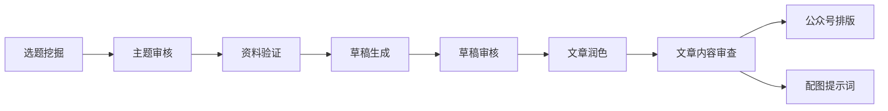

# ContentCreationKit 📝

**AI 驱动的内容创作工具包 — 从选题到发布的完整管线**

基于 [OpenCode](https://opencode.ai) 构建，集成搜索、写作、排版 Agent 工作流

---

## 概述

ContentCreationKit 是一套运行在 OpenCode 之上的内容创作工作流系统。它将选题挖掘、深度研究、草稿生成、AI 去味审核、文章润色、公众号排版、配图生成等环节组织为一条清晰的创作管线，全部通过命令驱动。

> 简而言之：**聚焦内容本身，流程交给工具链。**

---

## 核心工作流



| 阶段 | 命令 | 说明 | 输出 |
|------|------|------|------|
| ① 选题 | `/find-popular-topics` | 在主流平台挖掘高热话题 | content/topics/{时间戳}-{主题}.md |
| ② 审核 | `/review-topics` | 深度拷问主题，收集背景资料 | content/reference/{时间戳}-{主题}.md |
| ③ 验证 | `/review-reference` | 核实数据准确性与来源可靠性 | 修正意见（对话中） |
| ④ 草稿 | `/create-draft` | 生成自然耐读的中文草稿 | content/draft/{时间戳}-{主题}.md |
| ⑤ 审稿 | `/review-draft` | AI 去味检查 + 逻辑连贯性审核 | 审核意见（对话中） |
| ⑥ 成文 | `/to-article` | 润色为正式文章，生成候选标题 | content/article/{时间戳}-{主题}.md + 3 个候选标题 |
| ⑦ 审查 | `/review-article` | 核实文章内容与数据的准确性和时效性 | 审查意见（对话中） |
| ⑧ 排版 | `/to-wechat` | 公众号适配排版 (HTML) | content/WeChat/{时间戳}-{主题}.md + HTML |
| ⑨ 配图 | `/image-prompt` | 生成 AI 绘图封面提示词 | 2-3 组提示词（对话中） |

---

## 目录结构

```
ContentCreationKit/
├── .env                       # 环境变量（如 ARK_API_KEY）
├── .opencode/
│   ├── commands/              # 创作管线命令定义
│   │   ├── find-popular-topics.md
│   │   ├── review-topics.md
│   │   ├── review-reference.md
│   │   ├── create-draft.md
│   │   ├── review-draft.md
│   │   ├── review-article.md
│   │   ├── to-article.md
│   │   ├── to-wechat.md
│   │   ├── image-prompt.md
│   │   └── self-style.md
│   └── skills/                # 自定义创作技能
│       ├── article-extractor/
│       ├── article-to-presentation/   # HTML 演示文稿
│       ├── brainstorming/
│       ├── content-research-writer/
│       ├── grill-me/
│       ├── humanizer/
│       ├── image-generate/
│       ├── recursive-research/
│       ├── session-log/
│       ├── video-downloader/
│       ├── video-generate/
│       ├── wechat-format/
│       ├── writer-style/
│       └── youtube-transcript/
├── content/
│   ├── topics/                # 选题文件
│   ├── reference/             # 参考资料
│   ├── draft/                 # 草稿文件（gitignore）
│   ├── article/               # 正式文章
│   ├── WeChat/                # 公众号排版输出（gitignore）
│   ├── images/                # 文章配图 / 封面图（gitignore）
│   ├── video/                 # 视频生成产出（gitignore）
│   └── ppt/                   # HTML 演示文稿输出（gitignore）
├── docs/
│   └── superpowers/
│       ├── specs/             # 设计文档
│       └── plans/             # 实施计划
├── AGENTS.md                  # 代理工作指南（新会话先读此文件）
├── oh-my-openagent.json       # Agent 模型配置
├── StyleRule.md               # 编辑风格规则（11 条）
└── yuyang.jpg                 # 公众号二维码
```

---

## 快速开始

### 前提

- [OpenCode](https://opencode.ai) 已安装
- 必要的 MCP 服务已配置（Tavily、BraveSearch、BingSearch、Jina、ExaSearch、TrendsHub、Playwright）
- **新会话先读 `AGENTS.md`** — 包含管线顺序、数据验证规则、Git 规范等代理工作指南

### 使用

在 OpenCode 会话中，按管线顺序执行命令：

```
# 1. 找热门选题
/find-popular-topics

# 2. 审核并深化主题
/review-topics

# 3. 验证参考资料
/review-reference

# 4. 生成草稿
/create-draft

# 5. 审核草稿
/review-draft

# 6. 润色为正式文章
/to-article

# 7. 文章内容审查
/review-article

# 8. 排版到公众号
/to-wechat

# 9. 生成配图提示词
/image-prompt
```

每个命令都有前置条件，不能跳过。管线设计确保每一步的输出质量后才进入下一阶段。

---

## 命令参考

| 命令 | 描述 | 前置条件 | 输出 |
|------|------|----------|------|
| `/find-popular-topics` | 从知乎、微博、36氪等平台挖掘热门话题 | 无 | content/topics/{时间戳}-{主题}.md |
| `/review-topics` | 对主题进行深度拷问和背景研究 | 已完成 `/find-popular-topics`，或已有确认主题 | content/reference/{时间戳}-{主题}.md |
| `/review-reference` | 核实每条数据准确性和时效性 | 已完成 `/review-topics`，`content/reference/` 有资料 | 修正意见（对话中） |
| `/create-draft` | 生成 AI 去味的中文草稿 | 已完成 `/review-reference`，参考资料已确认 | content/draft/{时间戳}-{主题}.md |
| `/review-draft` | AI 腔检查 + 数据核对 + 逻辑审核 | 已完成 `/create-draft`，`content/draft/` 有草稿 | 审核意见（对话中） |
| `/to-article` | 润色草稿为正式文章 + 候选标题 | 已完成 `/review-draft`，草稿已通过审核 | content/article/{时间戳}-{主题}.md + 3 个候选标题 |
| `/review-article` | 核实文章内容与数据的准确性和时效性 | 已完成 `/to-article`，`content/article/` 有文章 | 审查意见（对话中） |
| `/to-wechat` | 公众号排版（HTML + 手机预览） | 已完成 `/to-article`，`content/article/` 有文章 | content/WeChat/{时间戳}-{主题}.md + HTML |
| `/image-prompt` | 生成封面图 AI 提示词 | 已完成 `/to-article`，或已有确认文章 | 2-3 组提示词（对话中） |
| `/self-style` | 从 diff 分析总结个人写作风格偏好 | 有已修改未提交的文章 diff | 风格分析总结（对话中） |

---

## 开发工具

```bash
# Python 环境（脚本从对应 venv 执行）
.venv/bin/python              # 根目录通用脚本
.opencode/skills/video-generate/.venv/bin/python  # 视频管线脚本

# HTML 演示文稿生成（article-to-presentation 技能使用）
python .opencode/skills/article-to-presentation/scripts/generate.py \
  --input content/article/YYYY-MM-DD-<topic>.md \
  --output content/ppt/YYYY-MM-DD-<topic>/
```

---

## 技能集

ContentCreationKit 集成了以下自定义技能，为创作管线提供能力支撑：

| 技能 | 作用 |
|------|------|
| **article-extractor** | 网页文章内容提取 |
| **article-to-presentation** | 文章转 HTML 演示文稿（B站视频素材） |
| **brainstorming** | 创意构思与需求梳理 |
| **content-research-writer** | 深度研究与内容写作协作 |
| **grill-me** | 对主题/方案进行压力拷问 |
| **humanizer** | AI 文本去味，消除 AI 腔 |
| **image-generate** | AI 封面图生成（Doubao Seedream 4.5） |
| **recursive-research** | 递归式深度研究（PhD 级别） |
| **session-log** | 会话日志汇总 |
| **video-downloader** | 视频下载 |
| **video-generate** | 文章转视频管线（场景分镜 + TTS + Remotion 渲染） |
| **wechat-format** | 微信公众号排版引擎 |
| **writer-style** | 思辨分析写作风格 |
| **youtube-transcript** | YouTube 字幕下载 |

---

## 技术栈

| 组件 | 用途 |
|------|------|
| **OpenCode** | AI 编码代理运行环境 |
| **Tavily MCP** | 综合性网络研究与搜索 |
| **BraveSearch MCP** | 搜索引擎 |
| **BingSearch MCP** | 中文搜索引擎 |
| **Jina MCP** | 网页内容提取 |
| **ExaSearch MCP** | 精准内容搜索与提取 |
| **TrendsHub MCP** | 各平台热点榜单聚合 |
| **Playwright MCP** | 浏览器自动化 |
| **oh-my-openagent** | Agent 模型配置与管理 |
| **Volces Ark / Doubao Seedream 4.5** | AI 封面图生图模型 |
| **Edge-TTS** | 视频管线中文语音合成 |
| **Remotion** | 文章转视频管线渲染引擎 |
| **Python HTML Template Engine + ECharts** | 演示文稿生成 |
| **@opencode-ai/plugin** | OpenCode 插件运行时 |
| **Python venv** | skills/scripts 的运行环境（两个：根目录 + video-generate） |

---

## 创作示例

`content/` 目录下已有的创作案例：

- **AI Agent 学习路线图（三篇系列）** — 运行时心脏 / RAG / LangChain 的完整教程
- **Agent-Loop 深度解析** — AI Agent 运行时循环的架构解构
- **Token-Jevons 悖论** — 越便宜花越多，Token 经济学底层规律（已制作成视频）
- **AI 时代灵魂拷问** — LLM 写作 vs 人的价值（全管线示例，含封面图）
- **华为全栈 Agent 战略** — 鸿蒙 + 盘古 + 昇腾深度分析
- **从 AGI 到 ASI** — 超级智能演进路径
- **DeepSeek 500 亿融资** — 反资本的资本局
- **微信 AI 专属卡 & 支付宝阿宝** — 超级 App Agent 化浪潮
- **国产大模型进入综合效率时代** — 成本战之后的竞争逻辑
- **AI 压缩了执行力，放大了判断力** — 人与 AI 协作的底层变化
- **AI 的决策半径正在变大** — 从辅助到自主的临界点
- **Claude Fable 5 越狱** — AI 大模型的安全阿喀琉斯之踵
- **MiMo Code vs Claude Code** — AI 编程工具架构分化
- **中国开源模型全球崛起** — DeepSeek、Qwen 等的国际影响力
- **能跑腿，不能碰钱的支付阿宝** — AI Agent 支付的安全边界
- **AI Agent 落地大考** — 个体 5 倍提效，组织不到 20%
- **Apple Core AI 框架深度解读** — 设备端大模型时代来临

每篇文章均经过完整管线处理，最终发布到微信公众号。

---

## 关注我的公众号


扫码关注「玉鸯」公众号

---

## 许可证

MIT
