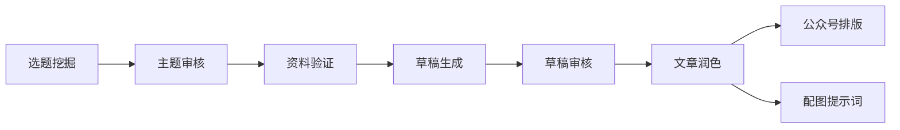

# ContentCreationKit 📝

**AI 驱动的内容创作工具包 — 从选题到发布的完整管线**

基于 [OpenCode](https://opencode.ai) 构建，集成搜索、写作、排版 Agent 工作流

---

## 概述

ContentCreationKit 是一套运行在 OpenCode 之上的内容创作工作流系统。它将选题挖掘、深度研究、草稿生成、AI 去味审核、文章润色、公众号排版、配图生成等环节组织为一条清晰的创作管线，全部通过命令驱动。

> 简而言之：**聚焦内容本身，流程交给工具链。**

---

## 核心工作流



| 阶段 | 命令 | 说明 |
|------|------|------|
| ① 选题 | `/find-popular-topics` | 在主流平台挖掘高热话题 |
| ② 审核 | `/review-topics` | 深度拷问主题，收集背景资料 |
| ③ 验证 | `/review-reference` | 核实数据准确性与来源可靠性 |
| ④ 草稿 | `/create-draft` | 生成自然耐读的中文草稿 |
| ⑤ 审稿 | `/review-draft` | AI 去味检查 + 逻辑连贯性审核 |
| ⑥ 成文 | `/to-article` | 润色为正式文章，生成候选标题 |
| ⑦ 排版 | `/to-wechat` | 公众号适配排版 (HTML) |
| ⑧ 配图 | `/image-prompt` | 生成 AI 绘图封面提示词 |

---

## 目录结构

```
ContentCreationKit/
├── .opencode/
│   ├── commands/          # 创作管线命令定义
│   │   ├── find-popular-topics.md
│   │   ├── review-topics.md
│   │   ├── review-reference.md
│   │   ├── create-draft.md
│   │   ├── review-draft.md
│   │   ├── to-article.md
│   │   ├── to-wechat.md
│   │   └── image-prompt.md
│   └── skills/            # 自定义创作技能
│       ├── brainstorming/
│       ├── content-research-writer/
│       ├── grill-me/
│       ├── humanizer/
│       ├── recursive-research/
│       ├── wechat-format/
│       ├── writer-style/
│       └── ...
├── content/
│   ├── topics/            # 选题文件
│   ├── reference/         # 参考资料
│   ├── draft/             # 草稿文件
│   ├── article/           # 正式文章
│   └── WeChat/            # 公众号排版输出
├── docs/
│   └── superpowers/specs/ # 设计文档
├── opencode.jsonc         # OpenCode 配置
└── oh-my-openagent.json   # Agent 模型配置
```

---

## 快速开始

### 前提

- [OpenCode](https://opencode.ai) 已安装
- 必要的 MCP 服务已配置（Tavily、BraveSearch、BingSearch、TrendsHub）

### 使用

在 OpenCode 会话中，按管线顺序执行命令：

```
# 1. 找热门选题
/find-popular-topics

# 2. 审核并深化主题
/review-topics

# 3. 验证参考资料
/review-reference

# 4. 生成草稿
/create-draft

# 5. 审核草稿
/review-draft

# 6. 润色为正式文章
/to-article

# 7. 排版到公众号
/to-wechat

# 8. 生成配图提示词
/image-prompt
```

每个命令都有前置条件，不能跳过。管线设计确保每一步的输出质量后才进入下一阶段。

---

## 命令参考

| 命令 | 描述 | 前置条件 |
|------|------|----------|
| `/find-popular-topics` | 从知乎、微博、36氪等平台挖掘热门话题 | 无 |
| `/review-topics` | 对主题进行深度拷问和背景研究 | 已确认主题 |
| `/review-reference` | 核实每条数据准确性和时效性 | `content/reference/` 有资料 |
| `/create-draft` | 生成 AI 去味的中文草稿 | 参考资料已确认 |
| `/review-draft` | AI 腔检查 + 数据核对 + 逻辑审核 | `content/draft/` 有草稿 |
| `/to-article` | 润色草稿为正式文章 + 候选标题 | 草稿已通过审核 |
| `/to-wechat` | 公众号排版（HTML + 手机预览） | `content/article/` 有文章 |
| `/image-prompt` | 生成封面图 AI 提示词 | 文章已定稿 |

---

## 技能集

ContentCreationKit 集成了以下自定义技能，为创作管线提供能力支撑：

| 技能 | 作用 |
|------|------|
| **brainstorming** | 创意构思与需求梳理 |
| **content-research-writer** | 深度研究与内容写作协作 |
| **grill-me** | 对主题/方案进行压力拷问 |
| **humanizer** | AI 文本去味，消除 AI 腔 |
| **recursive-research** | 递归式深度研究（PhD 级别） |
| **wechat-format** | 微信公众号排版引擎 |
| **writer-style** | 思辨分析写作风格 |
| **article-extractor** | 网页文章提取 |
| **youtube-transcript** | YouTube 字幕下载 |
| **video-downloader** | 视频下载 |
| **session-log** | 会话日志汇总 |

---

## 技术栈

| 组件 | 用途 |
|------|------|
| **OpenCode** | AI 编码代理运行环境 |
| **Tavily MCP** | 综合性网络研究与搜索 |
| **BraveSearch MCP** | 搜索引擎 |
| **BingSearch MCP** | 中文搜索引擎（天工） |
| **TrendsHub MCP** | 各平台热点榜单聚合 |
| **Playwright MCP** | 浏览器自动化 |
| **oh-my-openagent** | Agent 模型配置与管理 |

---

## 创作示例

`content/` 目录下已有的创作案例：

- **AI Agent 学习路线图** — 从运行时原理到 RAG、LangChain 的系列教程
- **华为全栈 Agent 战略** — 鸿蒙 + 盘古 + 昇腾 深度分析
- **AGI 到 ASI 演进** — 通向超级智能的技术路径
- **MiMo-Code vs Claude-Code** — AI 编程工具的架构分化
- **AI 价格战** — Token 经济学拐点分析

每篇文章均经过完整管线处理，最终发布到微信公众号。

---

## 关注我的公众号


扫码关注「玉鸯」公众号

---

## 许可证

MIT
