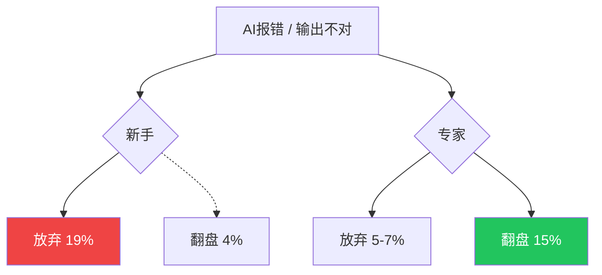

# ============================
# 封面
# ============================

---
layout: cover
---

# AI压缩了执行力，放大了判断力

为什么会用AI的人越来越值钱，不会用的人越来越焦虑

数据来源：Anthropic 2026.6 · Dallas Fed · KPMG

---
layout: statement
---

# 执行力↓　判断力↑

23.5万人 · 40万次真实会话 · 7个月追踪

# ============================
# 第一章 · 执行层的差距正在消失
# ============================

---
layout: section
---

# 第一章 · 执行层的差距正在消失

---
layout: quote
---

> 一个从没写过Python的会计，用Claude写对账脚本，成功率跟程序员差不多。

— Anthropic 分析 40 万次真实会话

---
layout: default
---

# 部分成功率：几乎一样

<NcBarChart
  title="「至少部分成功」会话占比"
  :labels="['软件工程师', '其他职业']"
  :data="[89, 88]"
  :colors="['var(--nc-success)', 'var(--nc-accent)']"
  height="280"
/>

差距仅 1%——执行层的差异正在被压平

---
layout: default
---

# 严格成功率：差距拉大

<NcBarChart
  title="严格验证成功会话占比"
  :labels="['新手', '中级', '高级']"
  :data="[15, 28, 33]"
  :colors="['var(--nc-danger)', 'var(--nc-accent)', 'var(--nc-accent)']"
  height="280"
/>

*"the gains come mostly from competence, not mastery"* — Anthropic

---
layout: metrics
---

::metrics::

  19%
  新手遇到问题直接放弃

  5-7%
  专家放弃率

  4%
  新手翻盘概率

  15%
  专家翻盘概率

---
layout: diagram
---

::left::
#### 差距不在"会不会写代码"

在"碰到问题后能不能搞定"

- AI让本来就知道自己要什么的人变得极强
- 让不知道自己在做什么的人更快地撞墙

::right::

# ============================
# 第二章 · 同一句话，不同价格
# ============================

---
layout: section
---

# 第二章 · 同一句话，不同价格

---
layout: quote
---

> 同一个AI，对不同的人"努力程度"不一样。

— 因为指令质量

---
layout: comparison
---

::left::
### 新手
每指令 **5** 个动作
输出 **600** 词

模糊指令 · 无验收标准 · 跑两步就撞墙

::right::
### 专家
每指令 **12** 个动作
输出 **3,200** 词

精确指令 · 约束清楚 · 知道什么算"对了"

动作链 2x　输出量 5x

---
layout: comparison
---

::left::
### 新手一条指令
600 词

"你帮我写个对账脚本"

::right::
### 专家一条指令
3,200 词

"这个脚本要处理三种异常情况，金额字段是 string 类型要先转，输出格式要跟财务系统对齐——你先读一下现有的 CSV 结构再动手"

---
layout: statement
---

> "People decide what to build, and the agent decides how to build it."

— Anthropic

---
layout: comparison
---

::left::
### 新手：人帮AI干活
"帮我写个对账脚本"

模糊 → 跑两步就撞墙

::right::
### 专家：AI帮人干活
"处理三种异常，金额转 string，对齐财务系统格式"

精确 → 跑得又快又远

# ============================
# 第三章 · 梯子正在被抽掉
# ============================

---
layout: section
---

# 第三章 · 梯子正在被抽掉

---
layout: quote
---

> 传统白领成长路径：毕业做执行——写周报、做PPT、跑数据——三五年后开始独立做判断。

问题在于：AI正在让那些"边干边学"的入门岗位变得不经济。

---
layout: comparison
---

::left::
### 被替代
可编码的知识

手册 · 模板 · 流程
能被写成文字的东西

AI 正在快速吃掉

::right::
### 被放大
默会知识

靠经验积累 · 说不清楚但会用
"见过足够多烂摊子才知道怎么办"

Dallas Fed 2026.2

---
layout: quote
---

> Firms are going to find that AI is making this method of employee development cost-ineffective, at least in the short run.

— Dallas Fed

---
layout: default
---

# AI协作模式正在迁移

<NcLineChart
  title="会话类型占比变化（7个月）"
  :labels="['Oct', 'Nov', 'Dec', 'Jan', 'Feb', 'Mar', 'Apr']"
  :datasets="[
    { label: '修复代码', data: [33, 30, 27, 25, 22, 20, 19], color: 'var(--nc-danger)' },
    { label: '写新代码', data: [10, 12, 14, 16, 18, 19, 20], color: 'var(--nc-success)' },
    { label: '数据分析', data: [10, 11, 13, 15, 17, 19, 20], color: 'var(--nc-accent)' },
  ]"
/>

从"帮我改bug" → "帮我从头完成一件事"

# ============================
# 第四章 · 焦虑不是来自未知，来自已知
# ============================

---
layout: section
---

# 第四章 · 焦虑不是来自未知，来自已知

---
layout: quote
---

> 一边疯狂用AI，一边疯狂焦虑。

这不是悖论，这是同一件事的两面。

---
layout: default
---

# 中国AI使用率全球领先

<NcBarChart
  title="职场AI应用率"
  :labels="['中国', '全球平均']"
  :data="[93, 58]"
  :colors="['var(--nc-accent)', '#6b7280']"
  height="280"
/>

KPMG/墨尔本大学 · 47个国家 · 约4.8万人 · 2025

---
layout: metrics
---

::metrics::

  40%
  年轻人有AI焦虑

  59%
  担心被替代

  93%
  却还在疯狂使用

---
layout: quote
---

> 越了解AI，人越焦虑。不是因为怕工具太强，是因为工具让那些曾经看起来"我也能做"的工作变得透明了——你清楚地看见了自己到底在哪个环节创造价值。

 

**案例**：广告公司策略总监，团队裁了1/3。客户直接拿AI方案来确认方向——他只需要说"行"或"不行"。工作量没变少，对判断力要求更高了。

# ============================
# 第五章 · 判断力会不会也被压缩？
# ============================

---
layout: section
---

# 第五章 · 判断力会不会也被压缩？

---
layout: quote
---

> 那万一AI把判断力也学会了呢？

这个担忧需要分层。

---
layout: comparison
---

::left::
### 执行判断
"这段代码性能够不够"
"这个清洗步骤对不对"

基于规则和可验证的标准

目前 70% 的规划决策仍由人做出
但这一比例正在下降

AI正在快速逼近

::right::
### 价值判断
"这个功能值不值得做"
"决策错了最坏结果能不能承担"

基于经验、直觉、对业务的理解
无数具体场景里熬出来的直觉

只有时间能磨

---
layout: statement
---

# 你可以让AI写一千个方案

# 但最后拍板说"就用这个"的是人

签字的那个、担责任的那个、出了问题被叫进办公室的那个

# ============================
# 结尾
# ============================

---
layout: quote
---

> Coding agents are not substituting for domain expertise—the more understanding a worker brings to an agent, the more quality work the agent is able to do.

— Anthropic

---
layout: statement
---

# 如果你的工作能被AI做完

# 有哪个决定你仍然不敢交给它？

那个不敢交付的瞬间，至少目前来看，还是你守得住的东西

---
layout: default
---

# 数据来源

1. **Anthropic** — Agentic coding and persistent returns to expertise (2026-06-16)
2. **Dallas Fed** — AI is simultaneously aiding and replacing workers (2026-02-24)
3. **KPMG/墨尔本大学** — Trust, attitudes and use of AI: Global study (2025)
4. **澎湃新闻·对齐Lab** — 2025年人工智能公众态度追踪调查报告
5. **Soul研究院** — 2025 Z世代AI使用报告 (2025-04)
6. **虎嗅** — 中国人的AI焦虑，又领先了 (2026-05-08)