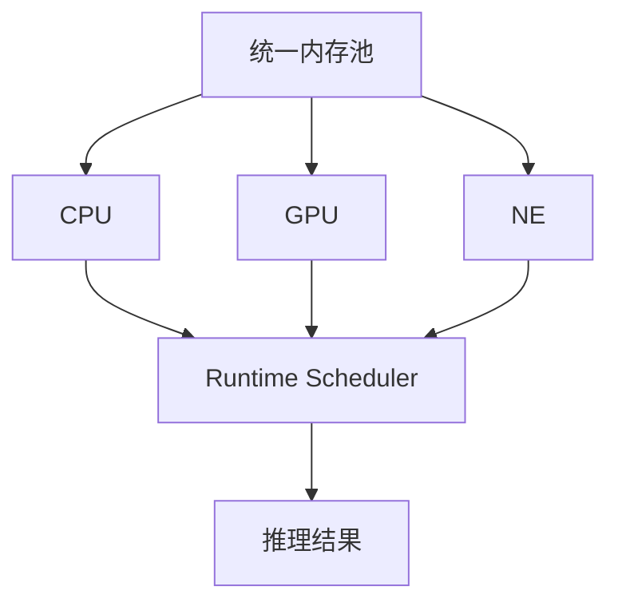
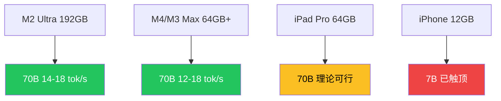

---
layout: cover
# 苹果在 AI 时代的真正护城河

## 低调的 Core AI

WWDC 2026 · 设备端大模型时代来临 | 基于 Apple Developer Sessions 325/326 等 9 个来源
---

---
layout: quote
---
# 「苹果在 AI 时代的真正护城河——不是模型产不产得出，而是产出的模型能不能在自家硬件上跑到最优」

WWDC 2026 · Core AI 框架深度解读

---

---
layout: section
---
# 第一章 · 双轨 AI 战略

开放合作 × 垂直自研
---

---
layout: quote
---
# 「我们使用的 Google Assistant 数量为零」

苹果不是把 Gemini 模型嵌进系统，而是用 Gemini 前沿模型的输出做知识蒸馏，训练出为 Apple Silicon 定制的 Foundation Models

— Federighi, WWDC 2026 主题演讲次日

---

---
layout: default
---
# 消费者层：开放合作补齐

- **消费者端**：Siri AI 全面升级
- **底层模型**：基于 Gemini 前沿模型蒸馏 → Apple Silicon 定制 Foundation Models
- **合作策略**：谁家模型强就用谁家的来蒸馏，Gemini 现在是首选，ChatGPT 和 Claude 也在备选名单里
- **战略本质**：消费者不在乎底层模型是谁，他们在乎 Siri 能不能听懂话

来源: Apple Newsroom, WWDC 2026 Keynote

---

---
layout: comparison
---
::left::

### 消费端 · 开放合作

- Gemini 知识蒸馏
- ChatGPT / Claude 备选
- 消费者不在乎底层模型
- 在乎 Siri 能不能听懂话

::right::

### 开发者端 · 垂直自研

- Core AI + Apple Silicon 深耦合
- AOT 编译 + Metal 4 自定义内核
- 第三方框架跑不出同等效率
- 没有人比苹果更了解自己的芯片

来源: Apple Newsroom, Apple Developer Documentation

---

---
layout: default
---
# 苹果的历史剧本

<v-clicks>

- Safari 的浏览器引擎从来不是最快的，但 WebKit 在 iOS 上只有一个
- Metal 的图形 API 不是行业标准，但它是 唯一能直接调用 Apple GPU 原生指令的入口
- Core AI 在做同一件事

### 双轨 AI 战略的本质

消费端开放合作，补上模型能力的短板

基础架构端垂直自研，建一个别人无法复制的护城河

</v-clicks>

来源: Apple Newsroom, InfoQ

---

---
layout: section
---
# 第二章 · Core AI 技术深潜

模型 → 原生二进制
---

---
layout: statement
---
# 让开发者把训练好的模型变成一个苹果设备上的原生二进制产物

就像编译一个 App Extension 一样

---

---
layout: default
clicks: 4
---
# Core AI 工作流

<NcSteps
  :steps="[
    { title: 'PyTorch 导出', status: 'done' },
    { title: 'TorchConverter 转换', status: 'done' },
    { title: 'AOT 编译 (.aimodel → .aimodelc)', status: 'active' },
    { title: '设备端 Specialization', status: 'pending' },
  ]"
/>

<v-clicks>

**① 导出：** `torch.export.export()` → 中间表示
**② 转换：** `coreai_torch.TorchConverter()` → `save_asset()` → `.aimodel`
**③ 编译：** `xcrun coreai-build --platform iOS` → `.aimodelc`
**④ 部署：** 打包进 App，设备端仅做 device-specific specialization

</v-clicks>

来源: Apple Developer Session 325

---

---
layout: comparison
---
::left::

### 传统 JIT（其他框架）

- 编译发生在设备端
- 用户打开 App，第一次用到 AI 功能时
- 卡三五秒
- 不适合移动端体验

::right::

### 苹果 AOT（Core AI）

- 编译在开发者的 Mac 上完成
- 用户设备端只需要 thin specialization
- 延迟在发布前吃完
- 适合生产级 App

这个设计在移动端推理框架里不多见

---

---
layout: default
---
# Metal 4 · 底层加速

Core AI 预置 Transformer 深度优化算子（Scaled Dot Product Attention 等）

<NcTerminal
  title="TorchMetalKernel 示例"
  :lines="[
    '// Metal 4 自定义 GPU 内核',
    '#include <metal_stdlib>',
    'using namespace metal;',
    '',
    'kernel void custom_attention(',
    '  device float* query [[buffer(0)]],',
    '  device float* key [[buffer(1)]],',
    '  device float* value [[buffer(2)]])',
    '{',
    '  // Core AI 自动调度到最优计算单元',
    '}',
  ]"
/>

Metal 4 随 macOS Tahoe (2025) 发布

---

---
layout: diagram
---
::left::

### 统一内存架构

CPU、GPU、NE 共享同一个内存池

- 数据不需要来回搬运
- 框架自动根据负载分配计算单元
- ComputeUnitKind: CPU / GPU / NE / 全部

::right::

来源: Apple Developer Core AI 文档

---

---
layout: default
---
# Swift 侧 API 设计

核心就三个概念：

| API | 作用 |
|-----|------|
| AIModel | 加载编译好的 .aimodelc 模型文件 |
| InferenceFunction | 执行推理调用 |
| NDArray | 管理多维张量输入输出 |

- KV Cache 直接暴露在 API 层面
- 3B 到 70B，调用方式完全一致

来源: Apple Developer Core AI 文档

---

---
layout: quote
---
# 「3B 参数的视觉模型到 70B 参数的推理模型，Swift 层调用方式一样——API 一致性本身就是维护成本」

Core AI 设计哲学

---

---
layout: section
---
# 第三章 · 70B 的真实边界

不是所有苹果设备都叫 Mac
---

---
layout: metrics
---
::metrics::

  ~40-46 GB
  70B Q4 量化内存占用

  12 GB
  iPhone 物理上限

  64 GB
  iPad Pro 最大配置

  64 GB+
  M4/M3 Max · 可行

包含权重 + KV Cache + 运行时

---

---
layout: diagram
---
::left::

### 设备分级

70B 能跑 ≠ iPhone 能跑

- **工作站级** (M2 Ultra 192GB): 70B 流畅 (14-18 tok/s)
- **专业级** (M4/M3 Max 64GB+): 70B 可行 (12-18 tok/s)
- **平板级** (iPad Pro 64GB): 理论可行
- **手机级** (iPhone 12GB): 3B-7B 已触顶

::right::

来源: 基于 Apple Silicon 芯片规格推算

---

---
layout: default
---
# 性能基准（社区实测）

<NcBarChart
  title="Apple Silicon LLM 推理速度 (Q4)"
  :labels="['7B M4 Max', '13B M4 Max', '70B M4 Max', '70B M2 Ultra']"
  :data="[87, 38, 15, 16]"
  :colors="['var(--nc-accent)', 'var(--nc-accent)', 'var(--nc-accent)', 'var(--nc-success)']"
  height="280"
/>

| 模型 | 框架 | tok/s |
|------|------|-------|
| 7B Q4 M4 Max | MLX | ~87 |
| 7B Q4 M4 Max | llama.cpp | 50-60 |
| 13B Q4 M4 Max | MLX | ~38 |
| 70B Q4 M3/M4 Max | MLX | 12-18 |
| 70B Q4 M2 Ultra | MLX | 14-18 |

数据来自 llama.cpp/Ollama/MLX 社区实测，非 Core AI 官方基准

---

---
layout: default
---
# 12-18 tok/s 意味着什么？

<v-clicks>

- 用户问一句话 → 等好几秒才看到完整回复
- 聊天场景不是大问题
- 流式输出交互会打折

### 苹果的取舍

"跑得起来" 本身就是信号：先别等云端 API 了

框架在 FP16/INT8/INT4 之间自动选择精度

</v-clicks>

来源: Apple Developer Session 326

---

---
layout: section
---
# 第四章 · Core ML 的九年

三层框架的必然分工
---

---
layout: default
---
# Core ML · 九年六次大版本

<NcSteps
  :steps="[
    { title: '2017 Core ML (iOS 11)', status: 'done' },
    { title: '2018 Core ML 2 (量化 75%)', status: 'done' },
    { title: '2019 Core ML 3 (ANE 开放)', status: 'done' },
    { title: '2021 ML Program 格式', status: 'done' },
    { title: '2023 MLX 发布', status: 'done' },
    { title: '2026 Core AI', status: 'active' },
  ]"
/>

| 年份 | 变化 |
|------|------|
| 2019 | ANE 首次对开发者开放 |
| 2021 | 从静态图走向动态图 |
| 2023 | MLX 独立发布 |
| 2026 | Core AI 正式取代 Core ML |

来源: Apple Developer 官方文档

---

---
layout: comparison
---
::left::

### Core ML（维护模式）

- 决策树、SVM、表格特征工程
- 不再添加新功能
- 存量模型通过兼容层可用
- 推荐重新编译为 Core AI 格式

::right::

### Core AI（主力） + MLX（研究）

**Core AI**: 神经网络 + Transformer
- 大语言模型、视觉模型
- 未来十年的主力框架

**MLX**: 自定义权重的训练和微调
- 面向研究人员

三个框架各退一步，边界清晰

---

---
layout: quote
---
# 「焊装车间和涂装车间不用同一套设备」

苹果选的不是合并，是分层

三层框架的必然分工

---

---
layout: section
---
# 第五章 · 生态锁定的底层逻辑

地基花园
---

---
layout: spotlight
---
# 不是围墙花园

## 是地基花园

你可以在花园里种任何东西，但土是苹果的

---

---
layout: comparison
---
::left::

### Apple 优势

- 芯片-框架-分发深度耦合
- AOT 编译 + Metal 4
- 统一内存架构
- 离开生态 = 推理栈重新设计

::right::

### 竞争变量

- Google AI Edge SDK (Android)
- 高通 Snapdragon NPU
- 开源框架短期内难以企及

苹果的优势在耦合深度

---

---
layout: default
---
# 为什么 Core AI 现在开放？

<v-clicks>

- Apple Intelligence 上线一年后
- Siri AI 接入 Gemini 蒸馏能力的同时
- 苹果把设备端推理框架向全体开发者开放

### 终局

AI 入口不再是 Siri 一个对话框，而是几十万个 App 的集成能力

</v-clicks>

来源: Apple Newsroom, InfoQ

---

---
layout: statement
---
# 当几十万个 App 的 AI 集成能力成为日常

没人在乎模型是蒸馏了 Gemini 还是 ChatGPT

体验的基石，是 Core AI

---

---
layout: default
---
# 数据来源

| # | 来源 | 类型 |
|---|------|------|
| 1 | Apple Developer Session 325/326 | 官方 |
| 2 | Apple Developer Core AI 文档 | 官方 |
| 3 | Apple Newsroom WWDC 2026 | 官方 |
| 4 | InfoQ | 媒体 |
| 5 | MacRumors | 媒体 |
| 6 | 少数派 | 媒体 |
| 7 | Blake Crosley blog | 开发者 |
| 8 | maxrave.dev | 开发者 |
| 9 | llama.cpp/Ollama/MLX 社区 | 社区基准 |

性能数据为社区实测，非 Core AI 官方基准

---

