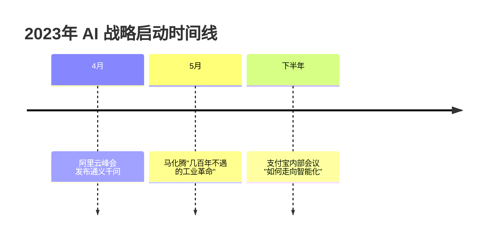
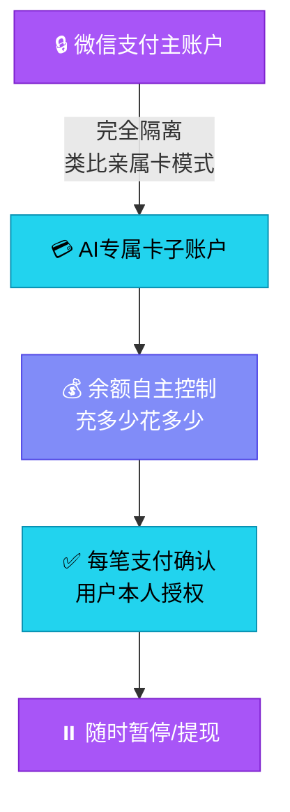
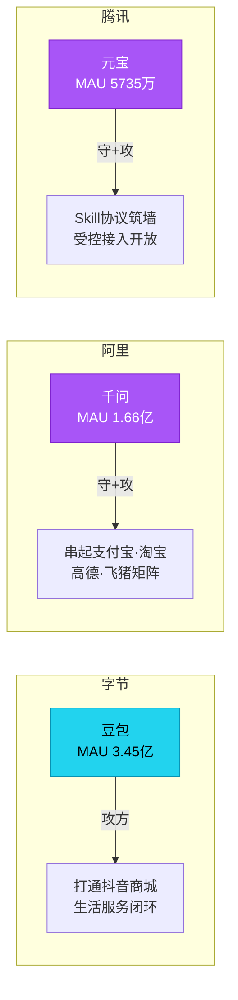

---
layout: cover
---

# 微信AI专属卡、支付宝阿宝与超级App的Agent化

一场2023年就已开始的"主动换芯"

2026年6月 · 超级App Agent化深度分析

---
layout: quote
---

> 媒体把这两件事并称为"反击豆包"。但我把过去三年的时间线摊开比对之后，得到的判断完全相反。

— 这不是反击，是换芯

---
layout: section
---

# 第一章
## 三年前那场没被注意的会议

---
layout: default
---

# 2023年 · 三家AI战略启动

同一时间段：豆包刚刚公测，DAU破亿还要再等两年多

---
layout: statement
---

# 腾讯和阿里对AI的投入与转型， 早就已经开始。

产品是预先架构好的，到时间点拿出来而已。

---
layout: section
---

# 第二章
## 微信AI专属卡：先搭架构，再出产品

---
layout: default
---

# AI专属卡四大产品特征

<NcSteps
  :steps="[
    { title: '子账户完全隔离', status: 'done' },
    { title: '充多少花多少·无默认限额', status: 'done' },
    { title: '三道安全机制·笔笔确认', status: 'done' },
    { title: '随时暂停·提现回零钱', status: 'done' },
  ]"
/>

来源：微信支付官方发布稿 · 新浪科技 · 财联社

---
layout: comparison
---

::left::

## 简单做法

直接授权AI调主账户

设个限额就完事

 

*"跟上AI时代"*

::right::

## 微信做法

另开一张专属卡

单独充钱 · 单独管理

专门发给AI智能体用

 

*"专款专用，笔笔确认"*

---
layout: default
---

# 安全机制三层架构

---
layout: statement
---

# 微信在给AI划一块"保留地"。

保留地里AI可以跑、可以花钱、可以代用户决策；

保留地外，主账户不动、人格不让、关系链不开放。

---
layout: section
---

# 第三章
## 支付宝阿宝：把"管钱"明确踢出AI范围

---
layout: comparison
---

::left::

## 🗣️ 阿宝 Tab

对话助手

调用上万种服务

叫车 · 外卖 · 酒店 · 挂号

*可发起支付，需本人确认*

::right::

## 📊 资产 Tab

独立账本

用户完全掌控

"管钱不交给AI"

*阿宝只做"哨兵"角色*

---
layout: quote
---

> "管钱"这件事，支付宝没有交给AI，而是用一个独立的"资产"页面呈现给用户。

— 上证报中国证券网 实测报道

---
layout: default
---

# 双重动机：为什么边界做得这么死

### 🛡️ 合规压力

支付宝在监管视野里的分量比微信支付还要重

资金管理权一旦交给AI模型决策，整个金融监管框架都要重新对齐

### 🏦 品牌承诺

二十年"放心存钱"心智是真正的护城河

不能为了追AI风口动摇这块根基

> "你敢付，我敢赔" — 蚂蚁支付宝事业群总裁 李俊

---
layout: section
---

# 第四章
## 小程序变Skill：协议层的预谋

---
layout: default
---

# 五条技术限制 · 逼开发者拆成能力单元

<NcSteps
  :steps="[
    { title: 'SKILL分包 independent:true · 最多30个', status: 'done' },
    { title: 'mcp.json 声明Schema · ≤24KB', status: 'done' },
    { title: 'SKILL.md 业务流程 · ≤16KB', status: 'done' },
    { title: '原子接口函数 · 隔离环境运行', status: 'done' },
    { title: '原子组件卡片渲染 · 不能滚动', status: 'done' },
  ]"
/>

来源：微信开放文档

---
layout: quote
---

> 文字链引回原页面，被定义为"兜底手段，用多了会降权"。

— 微信开放文档（翻译版）

微信主动把服务闭环留在AI对话里

---
layout: comparison
---

::left::

## 小程序时代

开发者做产品

用户搜索 → 找到打开使用

靠留存和广告变现

**人找服务 · 品牌可见**

::right::

## Skill 时代

开发者供能力

用户说话 → AI调Skill

品牌在用户端彻底消失

**AI安排服务 · 只剩接口**

---
layout: statement
---

# 微信主动把服务闭环留在AI对话里。

开发者从"做产品的人"变成"提供能力的供应商"。

---
layout: section
---

# 第五章
## 三方卡位战：各有底牌，各有短板

---
layout: default
---

# 三方AI助手 MAU 对比

<NcBarChart
  title="MAU 对比（百万）"
  :labels="['豆包 3.45亿', '千问 1.66亿', '元宝 5735万']"
  :data="[345, 166, 57.35]"
  :colors="['var(--nc-success)', 'var(--nc-accent)', 'var(--nc-accent)']"
  height="300"
/>

数据来源：公开数据 / QuestMobile 2026.03

---
layout: default
---

# 三家优劣势矩阵

### 字节豆包

**优势** 
流量最强 
MAU 3.45亿 · DAU破亿 
2025投流约4.35亿

**短板** 
缺支付 
缺社交关系链 
被主流App限制

### 阿里千问

**优势** 
生态执行力最强 
支付宝·淘宝·高德·飞猪 
ACT协议已在跑

**短板** 
MAU 1.66亿 
约豆包一半

### 腾讯微信

**优势** 
社交关系链最强 
微信合并MAU 14.32亿 
Skill私有协议

**短板** 
元宝MAU 5735万 
距豆包约6倍差距

---
layout: comparison
---

::left::

## 过去：人找服务

用户搜App打开用

开发者靠留存和广告变现

流量分配规则决定一切

**人在前面，AI在后台**

::right::

## 现在：AI安排服务

用户说话，AI调Skill

开发者失去"被用户主动选中"的环节

流量从人找服务变成AI安排服务

**AI在前面，人在后面**

---
layout: default
---

# 三方战略路径对比

---
layout: statement
---

# 三家都不是被动反应， 而是各自基于自己的位置在主动卡位。

豆包是攻方，腾讯阿里是守方加攻方。

---
layout: default
---

# 第五章（续）· 流量规则的颠覆

过去十年的小程序逻辑：人找服务。开发者做一个产品，用户搜出来点进去用，靠留存和广告变现。

Skill协议把这个模型直接翻过来：

 

**用户对AI说一句话 → AI决定调哪个Skill**

 

开发者第一次失去了"被用户主动选中"的环节。

---
layout: metrics
---

::metrics::

  27000+
  AI小程序加入「成长计划」

  超七成
  个人开发者占比

数据来源：36氪 2026年6月

---
layout: quote
---

> 一场比小程序更大的"收编"。

— 网易订阅 2026.6.12

小程序当年收编了独立App · 现在Skill再收编一次 · 剥掉品牌和用户关系 · 只留接口能力

---
layout: section
---

# 结尾
## 被换的"芯"不是技术，是身份

---
layout: spotlight
---

# 换芯不是App自己换， 是App加上它生态里的所有开发者一起换。

但开发者没有投票权。

---
layout: default
---

# 数据来源

- 新浪科技 — 微信AI专属卡官方发布
- 财联社 / 36氪 — AI专属卡上线报道
- 晚点LatePost — 阿宝项目立项独家
- IT之家 — 阿宝官宣邀测 · AI接入工具箱
- 智东西 — 阿宝实测 · 资产隔离原文
- 经济观察报 — 阿宝产品分析
- 上证报中国证券网 — "管钱不交给AI"
- 36氪 — 监管视角 · 成长计划数据
- 虎嗅 / 硅星人 — 小程序Skill化深度报道
- QuestMobile — 元宝MAU 5735万
- AppGrowing — 豆包投流成本估算
- 微信开放文档 — 小程序MCP/SKILL规范
- 公开数据 — 各平台MAU数据
- 腾讯股东大会 — 马化腾AI表态

以上 14 个来源交叉验证

