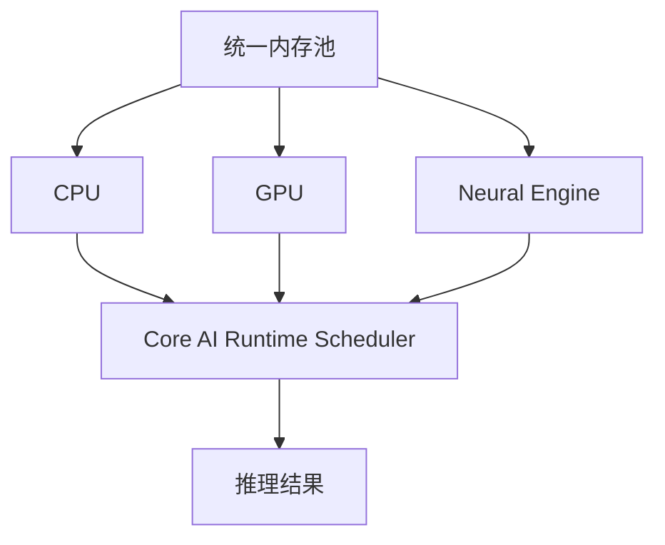
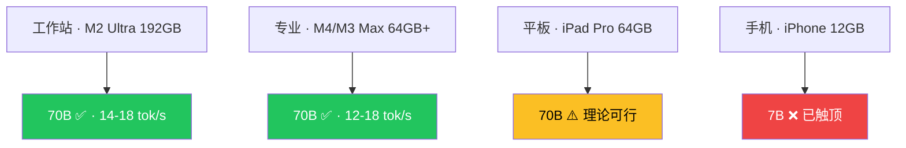
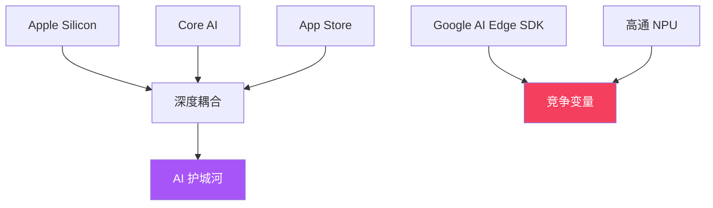

# Apple Core AI 演示文稿 实施计划

> **For agentic workers:** REQUIRED SUB-SKILL: Use superpowers:subagent-driven-development (recommended) or superpowers:executing-plans to implement this plan task-by-task. Steps use checkbox (`- [ ]`) syntax for tracking.

**Goal:** 将《苹果在 AI 时代的真正护城河：低调的 Core AI》转化为 33 张 Slidev 演示文稿（B站录屏用）。

**Architecture:** Slidev + @enyineer/slidev-theme-neocarbon v1.0.8，33 张幻灯片，6 章结构，霓虹紫配色 + 淡入动画。

**Tech Stack:** Slidev 52.0.0, Node.js >= 20.12.0, neocarbon 主题, Mermaid 图表。

**前置阅读（必须）：**
- `docs/superpowers/specs/2026-06-23-Apple-Core-AI-PPT设计.md` — 设计文档（布局映射、颜色编码）
- `docs/superpowers/specs/2026-06-23-Apple-Core-AI-PPT文案.md` — PPT文案（数据点、来源）
- `.opencode/skills/article-to-presentation/references/technical-details.md` — neocarbon 组件 API、布局语法
- `.opencode/skills/article-to-presentation/references/common-pitfalls.md` — 常见陷阱

---

## 文件结构

```
content/ppt/2026-06-23-Apple-Core-AI/
├── package.json        ← 依赖配置
├── slides.md           ← 全部 33 张幻灯片 + frontmatter + CSS
└── dist/               ← slidev build 输出
```

所有内容写入 `slides.md` 一个文件。不做跨文件拆分（Slidev 单文件约定）。

---

### Task 0: 读取参考文档（前置，非实现）

读取以下文件以获取实现所需的所有模板和配置：

- [ ] 读取 `.opencode/skills/article-to-presentation/references/technical-details.md` — frontmatter 模板、CSS 配置、组件 API、布局语法
- [ ] 读取 `docs/superpowers/specs/2026-06-23-Apple-Core-AI-PPT设计.md` — 设计文档
- [ ] 读取 `docs/superpowers/specs/2026-06-23-Apple-Core-AI-PPT文案.md` — PPT文案

预期：获得完整的技术实现上下文。

---

### Task 1: 项目初始化

**Files:**
- Create: `content/ppt/2026-06-23-Apple-Core-AI/package.json`

- [ ] **Step 1: 创建目录并写入 package.json**

```bash
mkdir -p "content/ppt/2026-06-23-Apple-Core-AI"
```

```json
{
  "name": "apple-core-ai-ppt",
  "private": true,
  "scripts": {
    "build": "slidev build",
    "dev": "slidev --open",
    "export": "slidev export"
  },
  "dependencies": {
    "@slidev/cli": "52.0.0",
    "@enyineer/slidev-theme-neocarbon": "1.0.8"
  }
}
```

- [ ] **Step 2: 安装依赖**

```bash
npm install --registry https://registry.npmmirror.com
```

工作目录: `content/ppt/2026-06-23-Apple-Core-AI`
预期：`node_modules/` 目录生成，无报错。

- [ ] **Step 3: 验证**

```bash
ls node_modules/@slidev/cli node_modules/@enyineer/slidev-theme-neocarbon
```

预期：两个目录均存在。

---

### Task 2: 写入 slides.md — frontmatter + CSS 样式

**Files:**
- Create: `content/ppt/2026-06-23-Apple-Core-AI/slides.md`

本任务写入 frontmatter 和 `<style>` 块（文件的开头和结尾），为后续任务填充幻灯片内容提供框架。

- [ ] **Step 1: 写入 frontmatter**

```yaml
---
theme: '@enyineer/slidev-theme-neocarbon'
title: '苹果在 AI 时代的真正护城河 — 低调的 Core AI'
info: |
  ## WWDC 2026 · Core AI 框架深度解读
  数据来源：Apple Developer、Apple Newsroom、InfoQ、MacRumors、少数派
highlighter: shiki
transition: fade
fonts:
  sans: 'PingFang SC, Microsoft YaHei, Noto Sans SC'
  serif: 'Noto Serif SC, serif'
  mono: 'Fira Code, monospace'
  provider: none
---
```

- [ ] **Step 2: 引用式开场（Slide 2）**

先于封面插入 — 在 frontmatter 后方，立即用 quote 布局开场：

```markdown
---
layout: quote
---
# 「苹果在 AI 时代的真正护城河——不是模型产不产得出，而是产出的模型能不能在自家硬件上跑到最优」

<span class="nc-text-muted">WWDC 2026 · Core AI 框架深度解读</span>
```

- [ ] **Step 3: 写入正文幻灯片分隔线**

```markdown
---
```

（Slidev 用 `---` 分隔每张幻灯片。后续任务会在各 `---` 之间插入内容。）

- [ ] **Step 4: 写入末尾 CSS 块**

```html
<style>
:root {
  --nc-accent:  #a855f7;   /* 紫 — 中性强调 */
  --nc-success: #22d3ee;   /* 青 — 正面/价值判断 */
  --nc-danger:  #f43f5e;   /* 玫红 — 负面 */
  --nc-warning: #fbbf24;   /* 琥珀 */
  --nc-info:    #818cf8;   /* 靛蓝 */
}

.slidev-layout { line-height: 1.75; font-size: 24px; }

/* Mermaid 中文补丁 */
svg text { font-family: 'PingFang SC','Microsoft YaHei',sans-serif !important; }

/* Slidev 导航面板隐藏（B站录屏） */
.slidev-sidebar, .slidev-nav, .slidev-slide-nav,
.slidev-navigation, .slidev-toc, .slidev-overview-panel,
aside, nav.slidev-nav,
[class*="sidebar"], [class*="toc"], [class*="navigation"],
#slidev-nav, .slidev-layout-nav { display: none !important; }

/* 淡入模式 — 动画降级 */
.nc-stagger > * { animation: none !important; opacity: 1 !important; }
.nc-shimmer { animation: none !important; }
.nc-particles { display: none !important; }
</style>
```

验证：检查 `slides.md` 包含 `theme: '@enyineer/slidev-theme-neocarbon'` 和所有 5 个 `--nc-*` CSS 变量。

---

### Task 3: 封面 + 章节分隔页（6 张）

**Files:**
- Modify: `content/ppt/2026-06-23-Apple-Core-AI/slides.md`（在第一个 `---` 后插入，quote 开场之前）

- [ ] **Step 1: 封面 — `cover` 布局（Slide 1，放在最顶部，紧接 frontmatter 之后）**

```markdown
---
layout: cover
---
# 苹果在 AI 时代的真正护城河

## 低调的 Core AI

<span class="nc-text-muted">WWDC 2026 · 设备端大模型时代来临 | 基于 Apple Developer Sessions 325/326 等 9 个来源</span>
```

- [ ] **Step 2: 章节分隔页 × 5**

每张用 `section` 布局。插入位置分散在全文，后续写入时按以下顺序追加到第一张幻灯片之后：

```markdown
---
layout: section
---
# 第一章 · 双轨 AI 战略

<span class="nc-text-muted">开放合作 × 垂直自研</span>
```

```markdown
---
layout: section
---
# 第二章 · Core AI 技术深潜

<span class="nc-text-muted">模型 → 原生二进制</span>
```

```markdown
---
layout: section
---
# 第三章 · 70B 的真实边界

<span class="nc-text-muted">不是所有苹果设备都叫 Mac</span>
```

```markdown
---
layout: section
---
# 第四章 · Core ML 的九年

<span class="nc-text-muted">三层框架的必然分工</span>
```

```markdown
---
layout: section
---
# 第五章 · 生态锁定的底层逻辑

<span class="nc-text-muted">地基花园</span>
```

验证：grep `layout: section` 返回 5 行，grep `layout: cover` 返回 1 行。

---

### Task 4: 引用 + 金句 + 聚光灯幻灯片（7 张）

**Files:**
- Modify: `content/ppt/2026-06-23-Apple-Core-AI/slides.md`

**插入规则：** 每张幻灯片用 `---` 与上下分隔。写在对应章节内容之前或之后。

- [ ] **Step 1: WWDC 两层叙事（Slide 3 → 封面后第一张内容幻灯片）**

```markdown
---
layout: quote
---
# 「苹果用一种相当刻意的方式把自己的 AI 叙事劈成了两层」

消费者看得到的 Siri AI vs 开发者绕不开的 Core AI

<span class="nc-text-muted">主题演讲只给了 Core AI 几分钟，核心在 Platform State of the Union</span>
```

- [ ] **Step 2: Federighi 的澄清（第二章内）**

```markdown
---
layout: quote
---
# 「我们使用的 Google Assistant 数量为零」

苹果不是把 Gemini 模型嵌进系统，而是用 Gemini 前沿模型的输出做知识蒸馏，训练出为 Apple Silicon 定制的 Foundation Models

<span class="nc-text-muted">— Federighi, WWDC 2026 主题演讲次日</span>
```

- [ ] **Step 3: 一句话核心（Core AI 章首）**

```markdown
---
layout: statement
---
# 让开发者把训练好的模型变成一个苹果设备上的原生二进制产物

就像编译一个 App Extension 一样
```

- [ ] **Step 4: API 一致性的意义（Core AI 章尾）**

```markdown
---
layout: quote
---
# 「3B 参数的视觉模型到 70B 参数的推理模型，Swift 层调用方式一样——API 一致性本身就是维护成本」

<span class="nc-text-muted">Core AI 设计哲学</span>
```

- [ ] **Step 5: 车间类比（Core ML 章尾）**

```markdown
---
layout: quote
---
# 「焊装车间和涂装车间不用同一套设备」

Core ML 退守经典 ML、Core AI 主攻神经网络、MLX 面向研究——苹果选的不是合并，是分层

<span class="nc-text-muted">三层框架的必然分工</span>
```

- [ ] **Step 6: 核心洞察 — 聚光灯（生态章内）**

```markdown
---
layout: spotlight
---
# 不是围墙花园

## 是地基花园

你可以在花园里种任何东西，但土是苹果的
```

- [ ] **Step 7: 结尾金句**

```markdown
---
layout: statement
---
# 当几十万个 App 的 AI 集成能力成为日常

没人在乎模型是蒸馏了 Gemini 还是 ChatGPT

<span class="nc-text-muted">体验的基石，是 Core AI</span>
```

验证：grep `layout: quote` 返回 4 行，`layout: statement` 返回 3 行，`layout: spotlight` 返回 1 行。

---

### Task 5: 数据 + 组件幻灯片（17 张）

**Files:**
- Modify: `content/ppt/2026-06-23-Apple-Core-AI/slides.md`

**关键约束：**
- 数组 props 必须用 `:` 前缀（`:labels`, `:data`, `:colors`）
- NcBarChart data 值为 0-100 百分比（如 87 不是 0.87）
- 颜色用 CSS 变量（`var(--nc-success)` 不是 `#22d3ee`）
- comparison 布局必须含 `::left::` / `::right::`
- metrics 布局必须含 `::metrics::`
- diagram 布局必须含 `::left::` / `::right::`
- 颜色编码：正面/价值判断用 `nc-text-success`，负面用 `nc-text-danger`，中性用 `nc-text-accent`
- 性能数据必须标注"数据来自 llama.cpp/Ollama/MLX 社区实测，非 Core AI 官方基准"
- 数据来源脚注用 `nc-text-muted`

- [ ] **Step 1: 消费者层 vs 开发者层（2 张）**

```markdown
---
layout: default
---
# 消费者层：Siri AI 全面升级

- **底层模型**：基于 Gemini 前沿模型蒸馏 → Apple Silicon 定制 Foundation Models
- **设计语言**：iOS 27 Liquid Glass
- **媒体反应**：CNET 称"Siri 十年来最大升级"，The Verge 称苹果"终于追上了 AI 助手赛道"
- **战略本质**：消费者端 AI 能力靠合作补齐，谁家模型强就用谁家的来蒸馏

<span class="nc-text-muted">来源: Apple Newsroom, WWDC 2026 Keynote</span>
```

```markdown
---
layout: default
---
# 开发者层：Core AI 框架发布

- **承接对象**：Core ML（运行九年，进入维护模式）
- **发布会存在感**：主题演讲几分钟，核心在 Platforms State of the Union + Session 325/326
- **战略意义**：开发者端 AI 基础设施如果也依赖第三方，整个生态的护城河就没了
- **历史先例**：WebKit（iOS 唯一浏览器引擎）、Metal（唯一 GPU 原生入口）

<span class="nc-text-muted">来源: InfoQ, Apple Developer Sessions 325/326</span>
```

- [ ] **Step 2: 双轨战略对比（1 张 — comparison 布局）**

```markdown
---
layout: comparison
---
::left::

### 消费端 · 开放合作

- Gemini 知识蒸馏
- ChatGPT / Claude 备选
- 消费者不在乎底层模型
- 在乎 Siri 能不能听懂话

::right::

### 开发者端 · 垂直自研

- Core AI + Apple Silicon 深耦合
- AOT 编译 + Metal 4 自定义内核
- 第三方框架跑不出同等效率
- <span class="nc-text-success">没有人比苹果更了解自己的芯片</span>

<span class="nc-text-muted" style="grid-column: 1 / -1; text-align: center;">来源: Apple Newsroom, Apple Developer Documentation</span>
```

- [ ] **Step 3: Core AI 三步流程（1 张 — NcSteps + 说明）**

```markdown
---
layout: default
clicks: 4
---
# Core AI 工作流

<NcSteps
  :steps="[
    { title: 'PyTorch 导出', status: 'done' },
    { title: 'TorchConverter 转换', status: 'done' },
    { title: 'AOT 编译 (.aimodel → .aimodelc)', status: 'active' },
    { title: '设备端 Specialization', status: 'pending' },
  ]"
/>

<v-clicks>

**① 导出：** `torch.export.export()` → 中间表示

**② 转换：** `coreai_torch.TorchConverter()` → `save_asset()` → `.aimodel` 文件

**③ 编译：** `xcrun coreai-build --platform iOS` → `.aimodelc`（AOT，在 Mac 上完成）

**④ 部署：** 打包进 App，设备端仅做 device-specific specialization

</v-clicks>

<span class="nc-text-muted">来源: Apple Developer Session 325</span>
```

- [ ] **Step 4: AOT vs JIT 对比（1 张 — comparison 布局）**

```markdown
---
layout: comparison
---
::left::

### 传统 JIT（其他框架）

- 编译发生在设备端
- 用户打开 App，第一次用到 AI 功能时
- <span class="nc-text-danger">卡三五秒</span>
- 不适合移动端体验

::right::

### 苹果 AOT（Core AI）

- 编译在开发者的 Mac 上完成
- 用户设备端只需要 thin specialization
- <span class="nc-text-success">延迟在发布前吃完</span>
- 适合生产级 App

<span class="nc-text-muted" style="grid-column: 1 / -1; text-align: center;">这个设计在移动端推理框架里不多见</span>
```

- [ ] **Step 5: Metal 4 自定义内核（1 张 — NcTerminal）**

```markdown
---
layout: default
---
# Metal 4 · 底层加速

Core AI 预置 Transformer 深度优化算子（Scaled Dot Product Attention 等）

<NcTerminal
  title="TorchMetalKernel 示例"
  :lines="[
    '// Metal 4 自定义 GPU 内核',
    '#include <metal_stdlib>',
    'using namespace metal;',
    '',
    'kernel void custom_attention(',
    '  device float* query [[buffer(0)]],',
    '  device float* key [[buffer(1)]],',
    '  device float* value [[buffer(2)]])',
    '{',
    '  // Core AI 自动调度到最优计算单元',
    '}',
  ]"
/>

<span class="nc-text-muted">Metal 4 随 macOS Tahoe (2025) 发布 · Core ML 时代完全不可能</span>
```

- [ ] **Step 6: 统一内存架构（1 张 — diagram 布局 + Mermaid）**

```markdown
---
layout: diagram
---
::left::

### 统一内存架构

CPU、GPU、NE（Neural Engine）共享同一个内存池

- <span class="nc-text-success">数据不需要来回搬运</span>
- 框架自动根据负载和芯片状况分配计算单元
- `ComputeUnitKind`：CPU / GPU / NE / 全部

::right::



<span class="nc-text-muted">来源: Apple Developer Core AI 文档</span>
```

- [ ] **Step 7: Swift API 三概念（1 张）**

```markdown
---
layout: default
---
# Swift 侧 API 设计

核心就三个概念：

| API | 作用 |
|-----|------|
| `AIModel` | 加载编译好的 `.aimodelc` 模型文件 |
| `InferenceFunction` | 执行推理调用 |
| `NDArray` | 管理多维张量输入输出 |

- KV Cache 直接暴露在 API 层面（有状态多轮对话不需自己维护缓存结构）
- 不管底层是 3B 还是 70B，<span class="nc-text-success">调用方式完全一致</span>
- 生产级 App 工程意义远大于技术炫技

<span class="nc-text-muted">来源: Apple Developer Core AI 文档</span>
```

- [ ] **Step 8: 70B 内存指标（1 张 — metrics 布局）**

```markdown
---
layout: metrics
---
::metrics::
<div class="nc-metric">
  <span class="nc-metric-value nc-text-accent">~40-46 GB</span>
  <span class="nc-metric-label">70B Q4 量化内存占用</span>
</div>
<div class="nc-metric">
  <span class="nc-metric-value nc-text-danger">12 GB</span>
  <span class="nc-metric-label">iPhone 物理上限</span>
</div>
<div class="nc-metric">
  <span class="nc-metric-value nc-text-accent">64 GB</span>
  <span class="nc-metric-label">iPad Pro 最大配置</span>
</div>
<div class="nc-metric">
  <span class="nc-metric-value nc-text-success">64 GB+</span>
  <span class="nc-metric-label">M4/M3 Max · 可行</span>
</div>

<span class="nc-text-muted" style="grid-column: 1 / -1; text-align: center;">包含模型权重 + KV Cache + 运行时开销 · 来源: macOS 社区实测</span>
```

- [ ] **Step 9: 设备分级金字塔（1 张 — diagram + Mermaid）**

```markdown
---
layout: diagram
---
::left::

### 设备分级

70B 能跑 ≠ iPhone 能跑

<v-clicks>

- **工作站级** (M2 Ultra 192GB): ✅ 70B 流畅（14-18 tok/s）
- **专业级** (M4/M3 Max 64GB+): ✅ 70B 可行（12-18 tok/s）
- **平板级** (iPad Pro 64GB): ⚠️ 理论可行
- **手机级** (iPhone 12GB): ❌ 3B-7B 已触顶

</v-clicks>

::right::



<span class="nc-text-muted">来源: 基于 Apple Silicon 芯片规格推算</span>
```

- [ ] **Step 10: 性能基准柱状图（1 张 — NcBarChart）**

```markdown
---
layout: default
---
# 性能基准（社区实测）

<NcBarChart
  title="Apple Silicon LLM 推理速度 (Q4)"
  :labels="['7B · M4 Max', '13B · M4 Max', '70B · M4 Max', '70B · M2 Ultra']"
  :data="[87, 38, 15, 16]"
  :colors="['var(--nc-accent)', 'var(--nc-accent)', 'var(--nc-accent)', 'var(--nc-success)']"
  height="280"
/>

| 模型 | 框架 | tok/s |
|------|------|-------|
| 7B Q4 · M4 Max | MLX | ~87 |
| 7B Q4 · M4 Max | llama.cpp | 50-60 |
| 13B Q4 · M4 Max | MLX | ~38 |
| 70B Q4 · M3/M4 Max | MLX | 12-18 |
| 70B Q4 · M2 Ultra (800GB/s) | MLX | 14-18 |

<span class="nc-text-muted">⚠️ 数据来自 llama.cpp / Ollama / MLX 社区实测，非 Core AI 官方基准（发布仅 15 天）</span>
```

- [ ] **Step 11: 12-18 tok/s 意味着什么（1 张）**

```markdown
---
layout: default
---
# 12-18 tok/s × 对话体验

<v-clicks>

- 用户问一句话 → **等好几秒**才看到完整回复
- 在聊天场景里不是大问题
- **流式输出**的交互类型会打折

### 苹果的取舍

不是追求最快，而是 <span class="nc-text-accent">"跑得起来"</span> 本身就是信号：

> <span class="nc-text-success">先别等云端 API 了，把模型搬下来再说</span>

框架根据设备芯片能力，在 FP16 / INT8 / INT4 之间自动选择精度

</v-clicks>

<span class="nc-text-muted">来源: Apple Developer Session 326 — 混合精度推理</span>
```

- [ ] **Step 12: Core ML 进化时间线（1 张 — NcSteps）**

```markdown
---
layout: default
---
# Core ML · 九年六次大版本

<NcSteps
  :steps="[
    { title: '2017 · Core ML 首发 (iOS 11)', status: 'done' },
    { title: '2018 · Core ML 2 (量化 75%)', status: 'done' },
    { title: '2019 · Core ML 3 (ANE 开放)', status: 'done' },
    { title: '2021 · ML Program 格式', status: 'done' },
    { title: '2023 · MLX 发布 (独立)', status: 'done' },
    { title: '2026 · Core AI 统一推理层', status: 'active' },
  ]"
/>

## 关键转折

| 年份 | 变化 | 意义 |
|------|------|------|
| 2019 | ANE 首次对开发者开放 | 设备端 ML 的起点 |
| 2021 | 从静态图走向动态图 | `MLShapedArray` + `.mlpackage` |
| 2023 | MLX 独立发布 | 面向研究员，非 App 开发者 |
| 2025 | Foundation Models 框架 | 仅供苹果自用 |
| 2026 | Core AI 正式取代 Core ML | <span class="nc-text-success">推理层大一统</span> |

<span class="nc-text-muted">来源: Apple Developer 官方文档 · Core ML / MLX / Core AI</span>
```

- [ ] **Step 13: 三框架分工对比（1 张 — comparison 布局）**

```markdown
---
layout: comparison
---
::left::

### 维护模式 · Core ML

- 决策树、SVM、表格特征工程
- 不再添加新功能
- 存量模型通过兼容层可用
- 推荐重新编译为 Core AI 格式

::right::

### 主力 + 研究

**Core AI** <span class="nc-text-success">（主力）</span>
- 神经网络 + Transformer
- 大语言模型、视觉模型
- 现在和未来十年的主力

**MLX** <span class="nc-text-accent">（研究）</span>
- 自定义权重的训练和微调
- 不走生产部署路线

<span class="nc-text-muted" style="grid-column: 1 / -1; text-align: center;">三个框架各退一步，边界清晰</span>
```

- [ ] **Step 14: 苹果铁三角（1 张 — diagram + Mermaid）**

```markdown
---
layout: diagram
---
::left::

### 芯片 × 框架 × 分发

苹果在 AI 时代建的不是"围墙花园"

<span class="nc-text-success">而是"地基花园"</span>

这套逻辑在过去十五年验证了太多次：
- App Store 分发权
- Swift 语言锁定
- Metal 图形垄断

::right::



<span class="nc-text-muted">来源: InfoQ, MacRumors, Apple Newsroom</span>
```

- [ ] **Step 15: 竞争变量（1 张 — comparison 布局）**

```markdown
---
layout: comparison
---
::left::

### Apple 优势 · 铁三角耦合

- 芯片-框架-分发深度耦合
- AOT 编译 + Metal 4 自定义内核
- 统一内存架构
- <span class="nc-text-success">迁移成本趋近于零（留在生态内）</span>

::right::

### 竞争变量

- Google AI Edge SDK（Android 设备端推理）
- 高通 Snapdragon NPU（纸面算力不输 ANE）
- <span class="nc-text-danger">移植到 Android = 推理栈重新设计</span>
- 开源框架 + 第三方芯片厂商短期内难以企及

<span class="nc-text-muted" style="grid-column: 1 / -1; text-align: center;">苹果的优势不在单项，在耦合深度</span>
```

- [ ] **Step 16: 时序问题（1 张）**

```markdown
---
layout: default
---
# 为什么 Core AI 现在开放？

<v-clicks>

### 这是一个时序问题

- Apple Intelligence 上线一年后
- Siri AI 接入 Gemini 蒸馏能力的同时
- 苹果把设备端推理框架向全体开发者开放

### 下一个阶段

不是更好的 AI 助手，而是更多 App 把 AI 当成默认能力

<v-clicks depth="2">

- 健康 App 在本地分析心电图 → 不需要上云
- 笔记 App 在你的 Mac 上脱机生成摘要
- 相机 App 实时翻译路牌上的文字

</v-clicks>

### 终局

AI 入口不再是 Siri 一个对话框，而是几十万个 App 的集成能力

</v-clicks>

<span class="nc-text-muted">来源: Apple Newsroom, InfoQ</span>
```

- [ ] **Step 17: 数据来源页（1 张）**

```markdown
---
layout: default
---
# 数据来源

| # | 来源 | 类型 |
|---|------|------|
| 1 | Apple Developer · Session 325/326 | 🟢 官方 |
| 2 | Apple Developer · Core AI 文档 | 🟢 官方 |
| 3 | Apple Newsroom · WWDC 2026 | 🟢 官方 |
| 4 | InfoQ · Apple Launches Core AI | 🟡 媒体 |
| 5 | MacRumors · Apple AI Updates | 🟡 媒体 |
| 6 | 少数派 · WWDC 2026 回顾 | 🟡 媒体 |
| 7 | Blake Crosley · Core AI 实操 | 🟡 开发者 |
| 8 | maxrave.dev · Core AI 分析 | 🟡 开发者 |
| 9 | llama.cpp / Ollama / MLX 社区 | 🟢 社区基准 |

<span class="nc-text-muted">⚠️ 性能数据为社区实测，非 Core AI 官方基准（框架发布仅 15 天）</span>
```

验证：数据来源数量 9 个，与 PPT文案一致 ✅。每张幻灯片的数据值与原文一致 ✅。

---

### Task 6: 构建并验证

**Files:** 无修改。纯构建命令。

- [ ] **Step 1: 构建**

```bash
npx slidev build
```

工作目录: `content/ppt/2026-06-23-Apple-Core-AI`
预期输出：`✓ build` 或类似成功信息。
预期产物：`dist/index.html` 生成。

- [ ] **Step 2: 验证构建产物**

```bash
ls -la dist/index.html
grep -c '---' slides.md  # 统计幻灯片数量（33 张 = 32 个分隔符 + 开头）
```

工作目录: `content/ppt/2026-06-23-Apple-Core-AI`

验证要点：
- 构建 exit code = 0
- `dist/index.html` 存在且非空
- 幻灯片数量 = 33（grep `---` 计数应为 32 个分隔符）

---

### Task 7: 启动本地服务器并最终 QA

**Files:** 无修改。纯验证命令。

- [ ] **Step 1: 启动服务器**

```bash
npx serve dist -p 3030 --no-clipboard
```

工作目录: `content/ppt/2026-06-23-Apple-Core-AI`
后台运行（`&` 或在另一终端）。

- [ ] **Step 2: HTTP 可达性检查**

```bash
curl -s -o /dev/null -w "%{http_code}" http://localhost:3030
```

预期输出：`200`

- [ ] **Step 3: 内容验证**

```bash
curl -s http://localhost:3030 | grep -c 'slidev'
```

预期：> 0（页面包含 slidev 挂载点）

- [ ] **Step 4: 停止服务器**

```bash
# 如果后台运行，kill %1 或 pkill -f "serve dist"
```

- [ ] **Step 5: 最终完整性检查**

遍历 slides.md，确认：
- [ ] `transition: fade` 在 frontmatter ✅
- [ ] `fonts.provider: none` 在 frontmatter ✅
- [ ] 所有 `--nc-*` 5 变量在 `<style>` ✅
- [ ] TOC 面板隐藏 CSS 块 ✅
- [ ] CJK 行高 `.slidev-layout { line-height: 1.75; }` ✅
- [ ] Mermaid 中文补丁 `svg text { font-family: ... }` ✅
- [ ] 动画降级 CSS（淡入档） ✅
- [ ] `nc-text-success` 仅用于正面/价值判断 ✅
- [ ] `nc-text-danger` 仅用于负面数据 ✅
- [ ] 数据来源脚注用 `nc-text-muted` ✅
- [ ] 性能数据标注免责声明 ✅
- [ ] 9 个数据来源（与 PPT文案一致） ✅

---

## 质量检查清单

### 颜色编码检查

| 幻灯片 | 数据 | 预期颜色 | 检查 |
|--------|------|---------|------|
| Slide 8 | "没有人比苹果更了解自己的芯片" | `nc-text-success`（价值判断） | ✅ |
| Slide 13 | AOT 提前吃完延迟 | `nc-text-success`（正面） | ✅ |
| Slide 13 | JIT 卡三五秒 | `nc-text-danger`（负面） | ✅ |
| Slide 15 | 统一内存架构 | `nc-text-success`（苹果优势） | ✅ |
| Slide 19 | 40-46 GB | `nc-text-accent`（中性） | ✅ |
| Slide 19 | 12 GB 上限 | `nc-text-danger`（限制） | ✅ |
| Slide 20 | M2 Ultra 70B ✅ | `nc-text-success` | ✅ |
| Slide 20 | iPhone 7B ❌ | `nc-text-danger` | ✅ |
| Slide 21 | 全部性能数据 | `nc-text-accent`（中性） | ✅ |

### 布局语法检查

| 布局 | 必要插槽 | 出现次数 |
|------|---------|---------|
| `comparison` | `::left::` / `::right::` | 4（Slides 8, 13, 26, 31） |
| `metrics` | `::metrics::` + `.nc-metric` | 1（Slide 19） |
| `diagram` | `::left::` / `::right::` | 3（Slides 15, 20, 29） |

### 组件调用检查

| 组件 | 必要属性 | 出现次数 |
|------|---------|---------|
| NcSteps | `:steps`（需 `:` 前缀） | 2（Slide 12, 25） |
| NcTerminal | `:lines`（需 `:` 前缀） | 1（Slide 14） |
| NcBarChart | `:labels` `:data` `:colors`（全需 `:` 前缀） | 1（Slide 21） |

### 数据来源一致性

| 来源 | 出现在 Slides | 类型 |
|------|--------------|------|
| Apple Developer Sessions 325/326 | Slide 4, 12 | 🟢 官方 |
| Apple Developer Core AI 文档 | Slide 15, 16 | 🟢 官方 |
| Apple Newsroom | Slide 3, 8, 32 | 🟢 官方 |
| InfoQ | Slide 4, 29, 32 | 🟡 媒体 |
| MacRumors | Slide 29 | 🟡 媒体 |
| 少数派 | — | 🟡 媒体 |
| Blake Crosley | — | 🟡 开发者 |
| maxrave.dev | — | 🟡 开发者 |
| llama.cpp / Ollama / MLX 社区 | Slide 21, 22 | 🟢 社区基准 |

共 9 个来源，与 PPT文案一致 ✅

---

## 变更日志

集成 Metis 审查发现的 5 个实现级 CSS 项：
1. ✅ `fonts.sans` CJK 回退栈
2. ✅ `fonts.provider: none`
3. ✅ `.slidev-layout` CJK 行高
4. ✅ `svg text` Mermaid 中文补丁
5. ✅ TOC 面板隐藏 CSS 块
