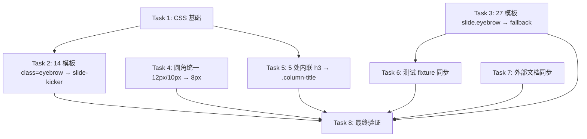

# Article-to-Presentation 样式系统清理 实施计划

> **For agentic workers:** REQUIRED SUB-SKILL: Use superpowers:subagent-driven-development (recommended) or superpowers:executing-plans to implement this plan task-by-task. Steps use checkbox (`- [ ]`) syntax for tracking.

**Goal:** 彻底收口 article-to-presentation 技能的 eyebrow→kicker 别名（CSS 类 + 数据键）、统一圆角到 8px、提取 5 处内联 `<h3>` 为 `.column-title` 类。

**Architecture:** 纯模板/CSS/文档层改动，不动 Python 逻辑。27 个 HTML 模板 + base.html CSS + 1 个测试 fixture + 4 个外部文档。使用 Jinja2 fallback 表达式 `{{ slide.kicker | default(slide.eyebrow | default('')) }}` 兼容存量 slides.json。

**Tech Stack:** Jinja2 HTML 模板、Python unittest、CSS3。

## Global Constraints

- **不改动任何 Python 代码**：`renderer/html_renderer.py`、`parser/`、`scripts/generate.py` 一律不碰。
- **不引入 CSS 变量统一 radius**：YAGNI，本次只收口 2 处离群值。
- **不重命名** `cover-title` / `cover-subtitle` / `item-title`：它们是清晰的语义命名，非新旧混用。
- **不改** `content/ppt/2026-06-24-DeepSeek-Agent-Strategy/PPT设计.md` 和 `docs/superpowers/plans/2026-06-24-DeepSeek-Agent-Strategy-PPT.md`：历史产物。
- **fallback 表达式统一格式**：`{{ slide.kicker | default(slide.eyebrow | default('')) }}`。
- **Git 提交规范**：中文 + semantic prefix（`refactor:`/`style:`/`docs:`/`test:`），每 Task 一个独立提交。
- **不自动 push**。

---

## 依赖关系图



**执行波次：**

| 波次 | 并行 Task | 说明 |
|------|-----------|------|
| Wave 1 | Task 1、Task 3、Task 4、Task 7 | 互不依赖的基础改动 |
| Wave 2 | Task 2、Task 5 | 依赖 Task 1 的 CSS 基础 |
| Wave 3 | Task 6 | 依赖 Task 3 的 fallback 表达式 |
| Wave 4 | Task 8 | 全量验证 |

---

## 任务列表

### Task 1: CSS 基础 — 删除 `.eyebrow` 别名 + 新增 `.column-title` 类

**Files:**
- Modify: `.opencode/skills/article-to-presentation/templates/base.html:137-146`（删除 `.eyebrow` 别名）
- Modify: `.opencode/skills/article-to-presentation/templates/base.html:377`（在 `.item-title` 之前新增 `.column-title` 类）

**Interfaces:**
- Produces: `.column-title` 和 `.column-title--lg` CSS 类，供 Task 5 引用。
- Produces: `.eyebrow` CSS 别名被移除，Task 2 必须在 Task 1 之后执行。

- [ ] **Step 1: 删除 base.html 中的 `.eyebrow` CSS 别名**

将 `base.html:137-146` 的双选择器组改为单选择器：

**现状（base.html:137-146）：**
```css
    .slide-kicker,
    .eyebrow {
      display: inline-block;
      font-size: 15px;
      font-weight: 700;
      letter-spacing: 0.08em;
      text-transform: uppercase;
      color: var(--accent-orange);
      margin-bottom: 14px;
    }
```

**目标：**
```css
    .slide-kicker {
      display: inline-block;
      font-size: 15px;
      font-weight: 700;
      letter-spacing: 0.08em;
      text-transform: uppercase;
      color: var(--accent-orange);
      margin-bottom: 14px;
    }
```

- [ ] **Step 2: 在 `.item-title` 之前新增 `.column-title` 类**

在 `base.html:378`（`.item-title {` 行）之前插入：

```css
    .column-title {
      font-size: 24px;
      font-weight: 700;
      line-height: 1.28;
      color: var(--text-secondary);
      margin-bottom: 24px;
    }
    .column-title--lg {
      font-size: 28px;
      margin-bottom: 20px;
    }

```

- [ ] **Step 3: 验证 CSS 改动**

Run:
```bash
grep -n "\.eyebrow" .opencode/skills/article-to-presentation/templates/base.html
grep -n "\.column-title" .opencode/skills/article-to-presentation/templates/base.html
```

Expected:
```
# 第一条命令无输出（.eyebrow 已删除）
# 第二条命令输出 2 行：
378:     .column-title {
384:     .column-title--lg {
```

- [ ] **Step 4: Commit**

```bash
git add .opencode/skills/article-to-presentation/templates/base.html
git commit -m "refactor: 移除 .eyebrow CSS 别名，新增 .column-title 类"
```

---

### Task 2: 14 个模板的 `class="eyebrow"` → `class="slide-kicker"`

**Files:**
- Modify: 14 个 HTML 模板（清单见下）

**Interfaces:**
- Consumes: Task 1 已删除 `.eyebrow` CSS 别名，仅保留 `.slide-kicker`。
- Produces: 27 个模板统一使用 `class="slide-kicker"`。

**14 个模板清单（精确行号）：**

| # | 文件 | 行 |
|---|------|----|
| 1 | `templates/data-area-chart.html` | 2 |
| 2 | `templates/data-bar-chart.html` | 2 |
| 3 | `templates/data-doughnut-chart.html` | 2 |
| 4 | `templates/data-horizontal-bar-chart.html` | 2 |
| 5 | `templates/data-line-chart.html` | 2 |
| 6 | `templates/data-mixed-chart.html` | 2 |
| 7 | `templates/data-pie-chart.html` | 2 |
| 8 | `templates/data-radar-chart.html` | 2 |
| 9 | `templates/table-comparison-table.html` | 2 |
| 10 | `templates/compare-three-column-flow.html` | 3 |
| 11 | `templates/layout-split-text-image.html` | 3 |
| 12 | `templates/layout-two-column-text.html` | 2 |
| 13 | `templates/layout-full-image.html` | 9 |
| 14 | `templates/terminal-code-terminal.html` | 2 |

> 路径前缀均为 `.opencode/skills/article-to-presentation/`

- [ ] **Step 1: 批量替换 14 个模板的 CSS 类名**

对每个文件，将 `class="eyebrow"` 替换为 `class="slide-kicker"`。所有 14 个文件的改动完全一致：

修改前：
```html
<span class="eyebrow">{{ slide.eyebrow | default('') }}</span>
```

修改后：
```html
<span class="slide-kicker">{{ slide.eyebrow | default('') }}</span>
```

> 注：本 Task 只改 CSS 类名，不改 `{{ slide.eyebrow }}` 数据键（那是 Task 3 的工作）。

- [ ] **Step 2: 验证替换结果**

Run:
```bash
grep -rn 'class="eyebrow"' .opencode/skills/article-to-presentation/templates/
grep -rn 'class="slide-kicker"' .opencode/skills/article-to-presentation/templates/ | wc -l
```

Expected:
```
# 第一条命令无输出（已无 class="eyebrow"）
# 第二条命令输出：27
```

- [ ] **Step 3: Commit**

```bash
git add .opencode/skills/article-to-presentation/templates/
git commit -m "refactor: 14 个模板 class=eyebrow → class=slide-kicker"
```

---

### Task 3: 27 个模板的 `{{ slide.eyebrow }}` → fallback 表达式

**Files:**
- Modify: 27 个 HTML 模板（全部 `templates/*.html`，不含 `base.html`）

**Interfaces:**
- Produces: 27 个模板统一使用 `{{ slide.kicker | default(slide.eyebrow | default('')) }}`。

**27 个模板清单：**

所有 `templates/` 目录下的 `.html` 文件（不含 `base.html`），每个文件有且仅有 1 处 `{{ slide.eyebrow | default('') }}`。

| 行号 | 模板数 | 模板举例 |
|------|--------|----------|
| 第 2 行 | 19 | data-*.html、layout-simple-text、summary-* 等 |
| 第 3 行 | 5 | compare-three-column-flow、layout-split-text-image、compare-before-after-cards、compare-before-after-metric、cover-hero-split |
| 第 5 行 | 1 | section-chapter |
| 第 9 行 | 1 | layout-full-image |

- [ ] **Step 1: 批量替换 27 个模板的数据键表达式**

对每个文件，将：
```
{{ slide.eyebrow | default('') }}
```
改为：
```
{{ slide.kicker | default(slide.eyebrow | default('')) }}
```

> **表达式语义**：先读 `slide.kicker`，为空回退到 `slide.eyebrow`，仍为空则空字符串。兼容新 `kicker` 字段和存量 `eyebrow` 字段。

**改动示例：**

修改前：
```html
<span class="slide-kicker">{{ slide.eyebrow | default('') }}</span>
```

修改后：
```html
<span class="slide-kicker">{{ slide.kicker | default(slide.eyebrow | default('')) }}</span>
```

- [ ] **Step 2: 验证替换结果**

Run:
```bash
grep -rln '\{\{ slide\.eyebrow' .opencode/skills/article-to-presentation/templates/ | wc -l
grep -rln 'slide\.kicker | default(slide\.eyebrow' .opencode/skills/article-to-presentation/templates/ | wc -l
```

Expected:
```
0       # 第一条：无旧表达式 {{ slide.eyebrow（不会匹配 fallback 内层）
27      # 第二条：27 个模板都用 fallback 表达式
```

> 说明：旧表达式 `{{ slide.eyebrow | default('') }}` 以 `{{ slide.eyebrow` 开头；新表达式 `{{ slide.kicker | default(slide.eyebrow | default('')) }}` 以 `{{ slide.kicker` 开头。grep 模式 `'{{ slide\.eyebrow'` 只能匹配旧表达式。

- [ ] **Step 3: Commit**

```bash
git add .opencode/skills/article-to-presentation/templates/
git commit -m "refactor: 27 个模板 slide.eyebrow → fallback 表达式兼容 kicker"
```

---


---

### Task 4: 圆角统一 — 12px / 10px → 8px

**Files:**
- Modify: `.opencode/skills/article-to-presentation/templates/layout-split-text-image.html:17`
- Modify: `.opencode/skills/article-to-presentation/templates/table-comparison-table.html:19-20`

**Interfaces:**
- 无外部依赖，独立改动。

- [ ] **Step 1: 修复 layout-split-text-image.html 的图像圆角**

**现状（layout-split-text-image.html:17）：**
```html
      
```

**目标：**
```html
      
```

- [ ] **Step 2: 修复 table-comparison-table.html 的 `<td>` 圆角（2 处）**

**现状（table-comparison-table.html:19-20）：**
```html
        <td style="padding: 16px; background: rgba(255,255,255,0.03); border-radius: 10px 0 0 10px; color: var(--text-secondary);">{{ row.before }}</td>
        <td style="padding: 16px; background: rgba(255,255,255,0.03); border-radius: 0 10px 10px 0; color: var(--text-primary);">{{ row.after }}</td>
```

**目标：**
```html
        <td style="padding: 16px; background: rgba(255,255,255,0.03); border-radius: 8px 0 0 8px; color: var(--text-secondary);">{{ row.before }}</td>
        <td style="padding: 16px; background: rgba(255,255,255,0.03); border-radius: 0 8px 8px 0; color: var(--text-primary);">{{ row.after }}</td>
```

- [ ] **Step 3: 验证圆角修复**

Run:
```bash
grep -nE "border-radius: (12|10)px" \
  .opencode/skills/article-to-presentation/templates/layout-split-text-image.html \
  .opencode/skills/article-to-presentation/templates/table-comparison-table.html
```

Expected:
```
# 无输出（已无 12px / 10px 圆角）
```

- [ ] **Step 4: Commit**

```bash
git add .opencode/skills/article-to-presentation/templates/layout-split-text-image.html \
       .opencode/skills/article-to-presentation/templates/table-comparison-table.html
git commit -m "style: 圆角统一 12px/10px → 8px"
```

---

### Task 5: 5 处内联 `<h3>` 提取为 `.column-title` 类

**Files:**
- Modify: `.opencode/skills/article-to-presentation/templates/layout-two-column-text.html:8, 12`
- Modify: `.opencode/skills/article-to-presentation/templates/compare-three-column-flow.html:9, 19, 35`

**Interfaces:**
- Consumes: Task 1 已在 base.html 新增 `.column-title` 和 `.column-title--lg` CSS 类。

- [ ] **Step 1: 提取 layout-two-column-text.html 的 2 处内联 `<h3>`（28px 变体）**

> **注意**：该模板的 `<h3>` 颜色由 Jinja2 模板变量控制（`var(--accent-{{ slide.data.left.color | default('red') }})`），不能提取到静态 CSS 类。颜色保留为内联样式，其他属性由 `.column-title--lg` 接管。

**现状（layout-two-column-text.html:8）：**
```html
    <h3 style="font-size: 28px; margin-bottom: 20px; color: var(--accent-{{ slide.data.left.color | default('red') }});">{{ slide.data.left.title }}</h3>
```

**目标（layout-two-column-text.html:8）：**
```html
    <h3 class="column-title column-title--lg" style="color: var(--accent-{{ slide.data.left.color | default('red') }});">{{ slide.data.left.title }}</h3>
```

**现状（layout-two-column-text.html:12）：**
```html
    <h3 style="font-size: 28px; margin-bottom: 20px; color: var(--accent-{{ slide.data.right.color | default('green') }});">{{ slide.data.right.title }}</h3>
```

**目标（layout-two-column-text.html:12）：**
```html
    <h3 class="column-title column-title--lg" style="color: var(--accent-{{ slide.data.right.color | default('green') }});">{{ slide.data.right.title }}</h3>
```

- [ ] **Step 2: 提取 compare-three-column-flow.html 的 3 处内联 `<h3>`（24px 变体）**

> **注意**：该模板的 `<h3>` 颜色为静态 `var(--text-secondary)`，可直接由 `.column-title` 的 `color` 属性覆盖，无需保留内联样式。

**现状（compare-three-column-flow.html:9）：**
```html
    <h3 style="font-size: 24px; margin-bottom: 24px; color: var(--text-secondary);">{{ slide.data.left.title }}</h3>
```

**目标（compare-three-column-flow.html:9）：**
```html
    <h3 class="column-title">{{ slide.data.left.title }}</h3>
```

**现状（compare-three-column-flow.html:19）：**
```html
    <h3 style="font-size: 24px; margin-bottom: 24px; color: var(--text-secondary);">{{ slide.data.center.title }}</h3>
```

**目标（compare-three-column-flow.html:19）：**
```html
    <h3 class="column-title">{{ slide.data.center.title }}</h3>
```

**现状（compare-three-column-flow.html:35）：**
```html
    <h3 style="font-size: 24px; margin-bottom: 24px; color: var(--text-secondary);">{{ slide.data.right.title }}</h3>
```

**目标（compare-three-column-flow.html:35）：**
```html
    <h3 class="column-title">{{ slide.data.right.title }}</h3>
```

- [ ] **Step 3: 验证 h3 提取**

Run:
```bash
grep -n 'style="font-size: 2[48]px; margin-bottom' \
  .opencode/skills/article-to-presentation/templates/layout-two-column-text.html \
  .opencode/skills/article-to-presentation/templates/compare-three-column-flow.html
grep -n 'class="column-title' \
  .opencode/skills/article-to-presentation/templates/layout-two-column-text.html \
  .opencode/skills/article-to-presentation/templates/compare-three-column-flow.html
```

Expected:
```
# 第一条命令无输出（已无内联 font-size/margin-bottom 的 h3）
# 第二条命令输出 5 行（2 处 column-title--lg + 3 处 column-title）
```

- [ ] **Step 4: Commit**

```bash
git add .opencode/skills/article-to-presentation/templates/layout-two-column-text.html \
       .opencode/skills/article-to-presentation/templates/compare-three-column-flow.html
git commit -m "refactor: 5 处内联 h3 提取为 .column-title 类"
```

---

### Task 6: 测试 fixture 同步 — eyebrow → kicker

**Files:**
- Modify: `.opencode/skills/article-to-presentation/tests/test_template_rendering.py:19, 27`

**Interfaces:**
- Consumes: Task 3 已让模板支持 `slide.kicker` 字段（带 fallback）。
- Produces: 测试 fixture 使用 `kicker` 字段，验证模板对新字段的正确渲染。

- [ ] **Step 1: 更新 test_template_rendering.py 的 fixture**

**现状（test_template_rendering.py:19）：**
```python
                    "eyebrow": "Agent Workflow",
```

**目标（test_template_rendering.py:19）：**
```python
                    "kicker": "Agent Workflow",
```

**现状（test_template_rendering.py:27）：**
```python
                    "eyebrow": "Context",
```

**目标（test_template_rendering.py:27）：**
```python
                    "kicker": "Context",
```

> 注：第 36 行的 `self.assertIn("class=\"slide-kicker\"", html)` 断言保留不变，已经是新 CSS 类名。

- [ ] **Step 2: 运行测试验证**

Run:
```bash
python -m unittest .opencode/skills/article-to-presentation/tests/test_template_rendering.py -v
```

Expected:
```
test_render_uses_refined_slide_system_classes (tests.test_template_rendering.TemplateRenderingTest) ... ok

----------------------------------------------------------------------
Ran 1 test in 0.0XXs

OK
```

> 如果测试失败，检查 Task 3 的 fallback 表达式是否正确应用到了 `cover-hero-center.html` 和 `layout-simple-text.html`（测试 fixture 使用的两个模板）。

- [ ] **Step 3: Commit**

```bash
git add .opencode/skills/article-to-presentation/tests/test_template_rendering.py
git commit -m "test: fixture 同步 eyebrow → kicker 字段"
```

---

### Task 7: 外部文档同步 — SKILL.md + 2 agent + design spec

**Files:**
- Modify: `.opencode/skills/article-to-presentation/SKILL.md:136`
- Modify: `.opencode/agents/context-cover.md:31`
- Modify: `.opencode/agents/visual-cover.md:30, 70`
- Modify: `docs/superpowers/specs/2026-06-25-article-to-presentation-html-engine-design.md:61, 160`

**Interfaces:**
- 无外部依赖，独立改动。

- [ ] **Step 1: 更新 SKILL.md 的 schema 文档**

**现状（SKILL.md:136）：**
```
- 输出：`slides.json`，含 `type`、`visual`、`title`、`subtitle`、`eyebrow`、`data: {}`
```

**目标（SKILL.md:136）：**
```
- 输出：`slides.json`，含 `type`、`visual`、`title`、`subtitle`、`kicker`、`data: {}`
```

- [ ] **Step 2: 更新 context-cover.md 的 JSON 示例**

**现状（context-cover.md:31）：**
```
"eyebrow": "可选小标签",
```

**目标（context-cover.md:31）：**
```
"kicker": "可选小标签",
```

- [ ] **Step 3: 更新 visual-cover.md 的 2 处 JSON 示例**

**现状（visual-cover.md:30）：**
```
"eyebrow": "ROOT CLAUDE.MD",
```

**目标（visual-cover.md:30）：**
```
"kicker": "ROOT CLAUDE.MD",
```

**现状（visual-cover.md:70）：**
```
{"badge": 1, "eyebrow": "第 1 章", "data": {"color": "orange"}}
```

**目标（visual-cover.md:70）：**
```
{"badge": 1, "kicker": "第 1 章", "data": {"color": "orange"}}
```

- [ ] **Step 4: 更新 design spec 的 TS 类型 + 排版表**

**现状（html-engine-design.md:61）：**
```
eyebrow?: string;         // 顶部小标签，如 "PROBLEM · 指令稀释"
```

**目标（html-engine-design.md:61）：**
```
kicker?: string;          // 顶部小标签，如 "PROBLEM · 指令稀释"
```

**现状（html-engine-design.md:160）：**
```
| 顶部 eyebrow | 16px | 600，letter-spacing: 0.1em |
```

**目标（html-engine-design.md:160）：**
```
| 顶部 kicker | 16px | 600，letter-spacing: 0.1em |
```

- [ ] **Step 5: 验证外部文档同步**

Run:
```bash
grep -rn "eyebrow" .opencode/skills/article-to-presentation/SKILL.md \
                 .opencode/agents/context-cover.md \
                 .opencode/agents/visual-cover.md \
                 docs/superpowers/specs/2026-06-25-article-to-presentation-html-engine-design.md
```

Expected:
```
# 无输出（所有外部文档已无 eyebrow 引用）
```

- [ ] **Step 6: Commit**

```bash
git add .opencode/skills/article-to-presentation/SKILL.md \
       .opencode/agents/context-cover.md \
       .opencode/agents/visual-cover.md \
       docs/superpowers/specs/2026-06-25-article-to-presentation-html-engine-design.md
git commit -m "docs: 外部文档同步 eyebrow → kicker"
```

---

### Task 8: 最终验证 — pytest + grep + 视觉检查

**Files:**
- 无文件改动，纯验证 Task。

**Interfaces:**
- Consumes: 所有前序 Task 的改动。

- [ ] **Step 1: 运行完整测试套件**

Run:
```bash
cd .opencode/skills/article-to-presentation && python -m unittest tests.test_template_rendering -v
```

Expected:
```
test_render_uses_refined_slide_system_classes (tests.test_template_rendering.TemplateRenderingTest) ... ok

----------------------------------------------------------------------
Ran 1 test in 0.0XXs

OK
```

- [ ] **Step 2: grep 验证 eyebrow 已彻底收口**

Run:
```bash
# 1. CSS 层：base.html 中无 .eyebrow 选择器
grep -n "\.eyebrow" .opencode/skills/article-to-presentation/templates/base.html

# 2. 模板层：无 class="eyebrow"
grep -rn 'class="eyebrow"' .opencode/skills/article-to-presentation/templates/

# 3. 模板层：无旧表达式 {{ slide.eyebrow（不匹配 fallback 内层）
grep -rln '\{\{ slide\.eyebrow' .opencode/skills/article-to-presentation/templates/ | wc -l

# 4. 外部文档：SKILL.md、agents、design spec 中无 eyebrow
grep -rn "eyebrow" \
  .opencode/skills/article-to-presentation/SKILL.md \
  .opencode/agents/context-cover.md \
  .opencode/agents/visual-cover.md \
  docs/superpowers/specs/2026-06-25-article-to-presentation-html-engine-design.md

# 5. 确认 fallback 表达式存在（兼容存量）
grep -rln 'slide\.kicker | default(slide\.eyebrow' .opencode/skills/article-to-presentation/templates/ | wc -l
```

Expected:
```
# 1. 无输出
# 2. 无输出
# 3. 输出 0
# 4. 无输出
# 5. 输出 27
```

- [ ] **Step 3: grep 验证圆角统一**

Run:
```bash
grep -rnE "border-radius: (12|10)px" \
  .opencode/skills/article-to-presentation/templates/
```

Expected:
```
# 无输出
```

- [ ] **Step 4: grep 验证 .column-title 类已应用**

Run:
```bash
grep -rn 'class="column-title' .opencode/skills/article-to-presentation/templates/
```

Expected:
```
.opencode/skills/article-to-presentation/templates/compare-three-column-flow.html:9:    <h3 class="column-title">{{ slide.data.left.title }}</h3>
.opencode/skills/article-to-presentation/templates/compare-three-column-flow.html:19:    <h3 class="column-title">{{ slide.data.center.title }}</h3>
.opencode/skills/article-to-presentation/templates/compare-three-column-flow.html:35:    <h3 class="column-title">{{ slide.data.right.title }}</h3>
.opencode/skills/article-to-presentation/templates/layout-two-column-text.html:8:    <h3 class="column-title column-title--lg" style="color: var(--accent-{{ slide.data.left.color | default('red') }});">{{ slide.data.left.title }}</h3>
.opencode/skills/article-to-presentation/templates/layout-two-column-text.html:12:    <h3 class="column-title column-title--lg" style="color: var(--accent-{{ slide.data.right.color | default('green') }});">{{ slide.data.right.title }}</h3>
```

- [ ] **Step 5: 生成测试 slides.html 并视觉验证**

构造一个包含以下布局的测试 slides.json，使用 `generate.py` 生成 slides.html：

```bash
mkdir -p /tmp/ppt-verify
cat > /tmp/ppt-verify/slides.json << 'JSON'
[
  {"type": "cover", "visual": "hero-center", "kicker": "TEST KICKER", "title": "样式清理验证", "subtitle": "eyebrow → kicker 迁移", "data": {"tags": ["验证"]}},
  {"type": "section", "visual": "chapter", "kicker": "SECTION 1", "title": "圆角与栏目标题"},
  {"type": "layout", "visual": "split-text-image", "kicker": "IMAGE RADIUS", "title": "图像圆角 8px", "data": {"image": "", "bullets": ["border-radius: 8px"]}},
  {"type": "layout", "visual": "two-column-text", "kicker": "COLUMN TITLE", "title": "栏目标题提取", "data": {"left": {"title": "左栏 28px", "color": "red", "content": "color: var(--accent-red)"}, "right": {"title": "右栏 28px", "color": "green", "content": "color: var(--accent-green)"}}},
  {"type": "compare", "visual": "three-column-flow", "kicker": "THREE COLUMN", "title": "三栏 24px", "data": {"left": {"title": "左", "items": ["a"]}, "center": {"title": "中", "items": ["b"]}, "right": {"title": "右", "items": ["c"]}}},
  {"type": "data", "visual": "bar-chart", "kicker": "DATA CHART", "title": "柱状图", "data": {"labels": ["A","B"], "series": [{"name": "S1", "data": [10, 20]}]}},
  {"type": "table", "visual": "comparison-table", "kicker": "TABLE RADIUS", "title": "表格圆角 8px", "data": {"rows": [{"category": "X", "before": "old", "after": "new", "color": "orange"}]}},
  {"type": "terminal", "visual": "code-terminal", "kicker": "TERMINAL", "title": "终端模板", "data": {"lines": ["$ echo hello"]}},
  {"type": "summary", "visual": "key-takeaways", "kicker": "SUMMARY", "title": "总结", "data": {"items": ["eyebrow → kicker 完成"]}}
]
JSON

python .opencode/skills/article-to-presentation/scripts/generate.py \
  --input /tmp/ppt-verify/slides.json \
  --output /tmp/ppt-verify/output/
```

Expected: 命令成功退出（exit code 0），`/tmp/ppt-verify/output/slides.html` 生成。

- [ ] **Step 6: 浏览器视觉验证**

用浏览器打开 `/tmp/ppt-verify/output/slides.html`，逐项检查：

| 检查项 | 预期 |
|--------|------|
| 眉标位置 | 所有 9 张幻灯片顶部小标签（"TEST KICKER" 等）正常显示，橙色大写 |
| 栏目标题字号 | layout-two-column-text 的 `<h3>` 为 28px；compare-three-column-flow 的 `<h3>` 为 24px |
| 栏目标题颜色 | layout-two-column-text 左栏红色、右栏绿色（动态颜色保留） |
| 图像圆角 | layout-split-text-image 的图像（如显示占位）圆角为 8px |
| 表格单元格圆角 | table-comparison-table 的 `<td>` 左下/右上圆角为 8px |
| 无回归 | 其他元素样式不受影响 |

- [ ] **Step 7: lsp_diagnostics 验证（可选）**

如使用 LSP，对改动的 HTML 文件运行诊断：

Run:
```bash
# 无 HTML LSP 时跳过此步
```

Expected: 无新增 error。

---

## 测试策略

### 后端（无 Python 改动）

本次不涉及 Python 逻辑改动，但测试 fixture（Task 6）需同步更新以验证模板对新 `kicker` 字段的支持。

- **TDD 顺序**：
  1. 先更新 fixture 为 `kicker` 字段（Task 6 Step 1）
  2. 运行测试，确认通过（Task 6 Step 2）——前提是 Task 3 已完成 fallback 表达式替换
  3. 如果 Task 3 未完成，测试会失败（模板仍读 `slide.eyebrow`，但 fixture 提供 `kicker`，渲染为空）

### 前端（HTML/CSS 模板）

无自动化组件测试。验证依赖：
1. grep 检查字符串替换完整性（每个 Task 的 Step 2/3）
2. 生成测试 slides.html + 浏览器视觉验证（Task 8 Step 5-6）

### 集成测试

- **部署后手动验证清单**：
  1. 运行 `python .opencode/skills/article-to-presentation/scripts/generate.py` 对真实文章生成 slides
  2. 浏览器打开生成的 slides.html，确认眉标、栏目标题、圆角无回归
  3. 用存量 slides.json（含 `eyebrow` 字段）测试 fallback 兼容性

---

## 风险与回滚

| 风险 | 缓解 | 回滚步骤 |
|------|------|----------|
| 存量 slides.json 用 `eyebrow` 字段，模板改后渲染空 | 模板用 `{{ slide.kicker \| default(slide.eyebrow \| default('')) }}` 过渡 | `git revert` 对应 commit |
| 遗漏某处 eyebrow 引用 | 每 Task 有 grep 验证步骤；Task 8 全量 grep | 补充替换并重新提交 |
| 内联 `<h3>` 提取后视觉差异 | Task 8 Step 5-6 生成测试 slides 并浏览器视觉验证 | `git revert` Task 5 的 commit |
| 测试失败 | Task 6 立即运行 pytest 确认 | 检查 fallback 表达式是否正确应用 |
| Task 1 删 CSS 后 Task 2 未及时跟进导致眉标失样式 | Task 2 必须在 Task 1 之后立即执行（Wave 2） | 按 Wave 顺序执行，不跳波次 |

### Git 回滚步骤

```bash
# 查看本次所有 commit
git log --oneline -8

# 回滚单个 Task
git revert <commit-hash>

# 回滚全部改动（危险：会丢失所有工作）
# 找到本次改动前的 commit
git log --oneline | head -10
git reset --hard <改动前的-commit-hash>
```

---

## 自审清单

- [x] 每个 Task 的验证命令精确可复制，包含预期输出
- [x] 代码片段中无 `...`、`// TODO`、`# implement later` 等占位符
- [x] 所有函数签名、行号、import 路径与实际代码一致（已通过 read + grep 验证）
- [x] Spec 的每项需求至少被一个 Task 覆盖：
  - Spec 目标 1（删 .eyebrow CSS）→ Task 1
  - Spec 目标 2（14 模板 class 改名）→ Task 2
  - Spec 目标 3（27 模板数据键改 fallback）→ Task 3
  - Spec 目标 4（外部文件同步）→ Task 6 + Task 7
  - Spec 目标 5（图像圆角）→ Task 4
  - Spec 目标 6（表格圆角）→ Task 4
  - Spec 目标 7（.column-title 类 + 5 处提取）→ Task 1 + Task 5
- [x] Task 粒度适中（5-15 分钟完成），可独立提交
- [x] 依赖图正确标注并行 vs 串行关系（Wave 1-4）
