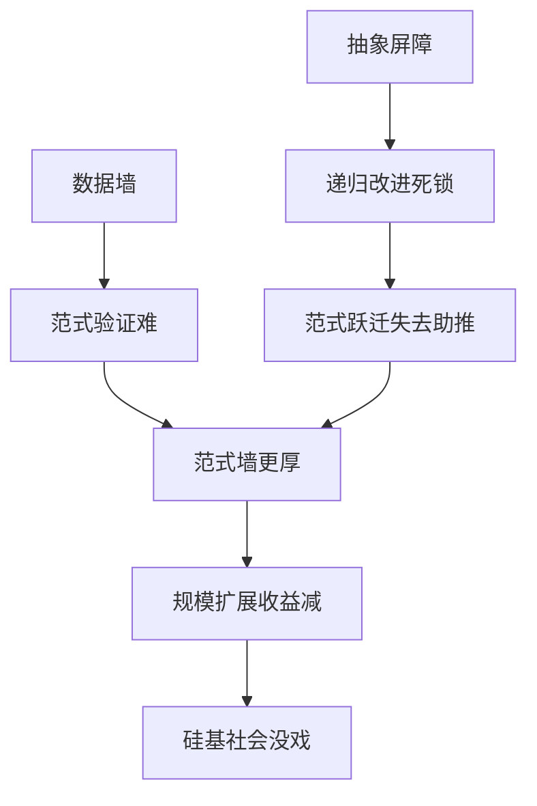

# 从 AGI 到 ASI - PPT 演示文稿实现计划

> **For agentic workers:** REQUIRED SUB-SKILL: Use superpowers:subagent-driven-development (recommended) or superpowers:executing-plans to implement this plan task-by-task. Steps use checkbox (`- [ ]`) syntax for tracking.

**Goal:** 将文章 `content/article/20260615-从AGI到ASI.md` 转换为符合 Slidev + neocarbon 主题标准的 16:9 HTML 演示文稿，用于 B 站视频录制。

**Architecture:** 遵循 `article-to-presentation` 技能规范，依赖项目根目录已安装的 `@slidev/cli` 和 `@enyineer/slidev-theme-neocarbon`，不单独初始化 package.json。所有幻灯片内容写入单个 `slides.md`，遵循 neocarbon 布局和组件 API，CSS 配置完整包含在文件末尾 `<style>` 块中。

**Tech Stack:**
- Slidev v52.0.0
- @enyineer/slidev-theme-neocarbon v1.0.8
- Mermaid 流程图（用于系统阻尼关系图）

---

## 文件结构

```
content/ppt/20260623-agi-to-asi/
└── slides.md           ← 本文档生成，完整 Slidev Markdown
```

---

## 任务分解

### Task 1: 创建 PPT 目录

**Files:**
- Create: `content/ppt/20260623-agi-to-asi/`

- [ ] **Step 1: 创建目录**

```bash
mkdir -p /Users/zero/GitHubProject/ContentCreationKit/content/ppt/20260623-agi-to-asi
```

- [ ] **Step 2: 验证目录创建成功**

```bash
ls -ld /Users/zero/GitHubProject/ContentCreationKit/content/ppt/20260623-agi-to-asi
```

预期输出：目录存在，权限正常。

### Task 2: 编写 `slides.md` frontmatter

**Files:**
- Create: `content/ppt/20260623-agi-to-asi/slides.md`

- [ ] **Step 1: 写入 frontmatter**

在文件开头写入以下 YAML：

```yaml
---
theme: '@enyineer/slidev-theme-neocarbon'
title: '从 AGI 到 ASI'
info: |
  ## DeepMind 四条通往超级智能的路线
  一亿个 ChatGPT 同时工作，等于超级智能吗？
highlighter: shiki
transition: fade
fonts:
  sans: 'PingFang SC, Microsoft YaHei, Noto Sans SC'
  serif: 'Noto Serif SC, serif'
  mono: 'Fira Code, monospace'
  provider: none
---
```

### Task 3: 编写封面和引子幻灯片

**Files:**
- Modify: `content/ppt/20260623-agi-to-asi/slides.md`

- [ ] **Step 1: 添加封面幻灯片**

```markdown
---
layout: cover
---
# 一亿个 ChatGPT 同时工作，<br>等于超级智能吗？

DeepMind 画出四条通往 ASI 的路线——以及为什么每条都还没修通
<br><span class="nc-text-muted">Genewein et al., Google DeepMind, 2026-06-10</span>
```

- [ ] **Step 2: 添加论文特殊性说明**

```markdown
---
layout: statement
---
# 一半写给人类，一半写给 AI

这是学术论文史上第一次，作者默认读完它的可能不只有人类。
<span class="nc-text-muted">论文本身就是它所论述对象的一个实例</span>
```

- [ ] **Step 3: 添加核心问题**

```markdown
---
layout: spotlight
---
# 如果 AI 达到普通人智能水平，<br>接下来会发生什么？
```

### Task 4: 添加第一章：四个并行的引擎

**Files:**
- Modify: `content/ppt/20260623-agi-to-asi/slides.md`

- [ ] **Step 1: 章节分隔页**

```markdown
---
layout: section
---
# 四个并行的引擎
```

- [ ] **Step 2: 路径一：堆规模**

```markdown
---
layout: default
---
# 第一条：堆规模

过去十年，**<span class="nc-text-accent">有效算力每年涨 10 倍</span>**
- 芯片性能 × 硬件投资 × 算法效率 = 1.5 × 2.5 × 3 ≈ 10

按这个速度，五年后：
- 从 1000 个 AGI 实例 → **<span class="nc-text-accent">一亿个</span>**
- 或者：让 100 万个实例思考快 **<span class="nc-text-accent">100 倍</span>**

效果相同。量变本身就等于质变。
```

- [ ] **Step 3: 堆规模核心观点（金句引用）**

```markdown
---
layout: quote
---
> 就算单个模型的智力永远卡在普通人水平，一亿个共享大脑、毫秒级通信、100 倍速思考的 AI 集群，本身就是一个超级智能。不用等什么范式突破。量变本身就等于质变.
```

- [ ] **Step 4: 路径二：换范式**

```markdown
---
layout: default
---
# 第二条：换范式

跳出当前 Transformer 预训练套路
- 新架构：Mamba、RWKV 小规模表现不错，但放大就掉队
- 全新训练方式：目前谁都画不出来

论文判断：<span class="nc-text-accent">最不可预测，但一旦突破收益最大</span>
```

- [ ] **Step 5: 路径三：AI 改 AI**

```markdown
---
layout: default
---
# 第三条：AI 改 AI

用 AI 加速 AI 研发，递归自我改进
- ✅ 弱版本已实现：写代码、数据标注
- ❌ 强版本还没影：让 AI 自己提出假设、设计实验、跑完分析

论文警告：现实系统里，这种循环<span class="nc-text-danger">更可能走出 S 曲线</span>，冲到某个高度就被拉平，而不是一路炸到奇点
```

- [ ] **Step 6: 路径四：硅基社会（左右对比）**

```markdown
---
layout: comparison
---
::left::
# 人类社会
- 语言带宽极低
- 分工协作慢
- 只能共享语言，不能共享思考

::right::
# 硅基社会
- 可共享梯度、权重快照
- **毫秒级认知同步**
- 一群普通人级 AGI + 硅基组织效率 = 超级智能
```

### Task 5: 添加第二章：四道锁死的墙

**Files:**
- Modify: `content/ppt/20260623-agi-to-asi/slides.md`

- [ ] **Step 1: 章节分隔页**

```markdown
---
layout: section
---
# 四道锁死的墙
```

- [ ] **Step 2: 第一道 —— 数据墙**

```markdown
---
layout: default
---
# 第一道：数据墙

Chinchilla 缩放定律：
> 模型参数翻倍，<span class="nc-text-danger">训练数据也得同步翻倍</span>

问题：高质量人类文本总量有限，当前最大训练集已经逼近上限

后果：替代范式（Mamba/RWKV）需要大规模数据验证 —— 但数据不够了
```

- [ ] **Step 3: 数据墙后果（statement）**

```markdown
---
layout: statement
---
# 数据墙让范式墙更难翻

<span class="nc-text-muted">替代范式验证本身就需要大规模数据</span>
```

- [ ] **Step 4: 第二道 —— 范式墙**

```markdown
---
layout: default
---
# 第二道：范式墙

当前 Transformer 套路增量改进多，架构级突破少
- Bloom et al. (2020): 维持同样进步速度，需要<span class="nc-text-danger">指数增长</span>的研究投入
- 半导体密度翻倍所需研究人员：现在是 1970 年代的 <span class="nc-text-danger">18 倍</span>

逻辑：如果每次范式跃迁都需要多一个数量级资源，而资源墙在收紧 —— 后面故事不太好讲
```

- [ ] **Step 5: 第三道 —— 资源墙**

```markdown
---
layout: default
---
# 第三道：资源墙

芯片 + 电力 + 资金，三样绑在一起
- 一亿个 AGI 推理能耗：<span class="nc-text-danger">全球数据中心总和的多个数量级</span>
- Stanford AI Index 2025：前沿训练算力需求 <span class="nc-text-danger">每 5 个月翻一倍</span>，远超硬件进步

结论：任何一个环节断裂（电力/芯片/投资），多智能体路径直接断供
```

- [ ] **Step 6: 第四道 —— 抽象屏障（最致命）**

```markdown
---
layout: spotlight
---
# 第四道：抽象屏障
AI 可能无法自发形成<br>人类式抽象概念
```

- [ ] **Step 7: Embodiment Factor 对比**

```markdown
---
layout: comparison
---
::left::
## 人类
- 大脑快，输出慢
- <span class="nc-text-success">倒逼深层抽象</span>
- 自发形成概念体系

::right::
## 机器
- I/O 带宽高得离谱
- <span class="nc-text-danger">不需要压缩抽象</span>
- 可能永远不会自发形成新概念
```

- [ ] **Step 8: 超级鹦鹉悖论（引用）**

```markdown
---
layout: quote
---
> 如果 AI 没法从原始数据中独立构建新概念，那单个模型永远是一只超级鹦鹉——困在人类认知的天花板下面.
```

- [ ] **Step 9: 抽象屏障后果**

```markdown
---
layout: default
---
# 后果：直接堵死递归自我改进

如果 AI 只能用人类创造的概念框架改进 AI ——
改进出来的还是同一套框架

数学等价于：<span class="nc-text-danger">在封闭解空间里爬山</span>，永远跳不到另一个山头
```

### Task 6: 添加第三章：墙不会单独来

**Files:**
- Modify: `content/ppt/20260623-agi-to-asi/slides.md`

- [ ] **Step 1: 章节分隔页**

```markdown
---
layout: section
---
# 墙不会单独来
```

- [ ] **Step 2: 系统阻尼（带 Mermaid 流程图）**

```markdown
---
layout: diagram
---
::left::
# 系统级摩擦力

瓶颈不是独立存在，它们互相锁死：
- 数据不够 → 范式无法验证
- 范式不突破 → 规模扩展边际收益递减
- 抽象屏障 → 递归改进闭环死
- 递归改进死 → 范式跃迁失去助推

这是整个系统级的阻尼.

::right::

```

### Task 7: 添加论文概率判断和第四章结论

**Files:**
- Modify: `content/ppt/20260623-agi-to-asi/slides.md`

- [ ] **Step 1: 论文核心判断（statement）**

```markdown
---
layout: statement
---
# 不太可能全部堵死

要让 AI 进步停在 AGI 阶段，
需要好几道关卡同时变成死路 ——
这种巧合<span class="nc-text-accent">不太可能发生</span>

<span class="nc-text-muted">但每个坑有多深，现在没人说得准</span>
```

- [ ] **Step 2: 章节分隔页**

```markdown
---
layout: section
---
# 结论与启示
```

- [ ] **Step 3: 核心观点**

```markdown
---
layout: statement
---
# 不是 "会不会来",
## 是 "从哪来，撞哪墙，花多久"
```

- [ ] **Step 4: AGI 到来图景**

```markdown
---
layout: default
---
# AGI 更可能是一系列连续冲击

顺序大致：
1. 先加速药物研发
2. 再改变材料科学
3. 然后渗透进经济社会毛孔

等我们反应过来，变化已经发生
```

- [ ] **Step 5: Hassabis 三层创造力**

```markdown
---
layout: comparison
---
::left::
### 阶段一：插值
✅ 现在做到了
在已知数据中取平均

### 阶段二：外推
✅ AlphaGo Move 37
从已知策略推演新走法

::right::
### 阶段三：发明
❓ 还没到这一步
只给爱因斯坦 1900 年信息，
AI 能否独立推导出广义相对论？

<span class="nc-text-muted">Demis Hassabis, 2025 播客访谈</span>
```

- [ ] **Step 6: 论文价值金句（引用）**

```markdown
---
layout: quote
---
> 它给的不是一张藏宝图，是一张水文地质勘测报告。不算性感。但比藏宝图有用得多.
```

### Task 8: 添加数据来源、结尾和 Q&A

**Files:**
- Modify: `content/ppt/20260623-agi-to-asi/slides.md`

- [ ] **Step 1: 数据来源列表**

```markdown
---
layout: default
---
# 数据来源

1. **一手** Genewein et al., "From AGI to ASI", Google DeepMind, arXiv:2606.12683, 2026-06-10
2. **二手** Hoffmann et al. (2022), Chinchilla 缩放定律
3. **二手** Bloom et al. (2020), "Are Ideas Getting Harder to Find?", *American Economic Review*
4. **二手** Neil Lawrence (2024), *The Atomic Human*
5. **二手** Stanford AI Index 2025 Report
6. **二手** Demis Hassabis (2025), 播客访谈
```

- [ ] **Step 2: 关注公众号**

```markdown
---
layout: statement
---
# 关注公众号「玉鸯」

深度科技思考，每周一篇
```

- [ ] **Step 3: Q&A**

```markdown
---
layout: statement
---
# Q&A

<span class="nc-text-muted">欢迎提问</span>
```

### Task 9: 添加完整 `<style>` 块（所有配置）

**Files:**
- Modify: `content/ppt/20260623-agi-to-asi/slides.md`

完整 CSS 代码从 `.opencode/skills/article-to-presentation/references/technical-details.md` 复制，包含：
1. 霓虹紫色色变量
2. CJK 行高配置
3. Mermaid 中文补丁
4. 淡入模式动画降级 CSS
5. 录屏导航面板隐藏（全量 selector）
6. 内容垂直居中 CSS

- [ ] **Step 1: 写入完整 CSS**

按照 `technical-details.md` 中的完整模板，将所有 CSS 复制到 `<style>` 标签中添加到文件末尾。

### Task 10: 构建验证

**Files:** 无文件修改，运行构建命令

- [ ] **Step 1: 在项目根目录执行 build**

```bash
cd /Users/zero/GitHubProject/ContentCreationKit && npx slidev build content/ppt/20260623-agi-to-asi/slides.md
```

预期：构建成功，生成 `content/ppt/20260623-agi-to-asi/dist/` 目录。
